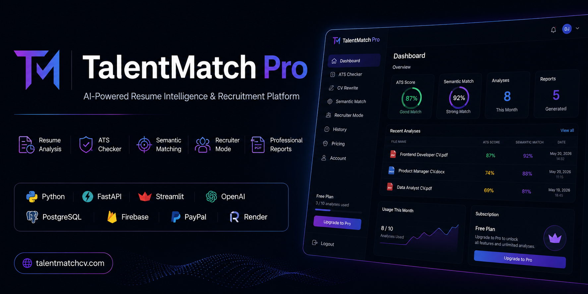
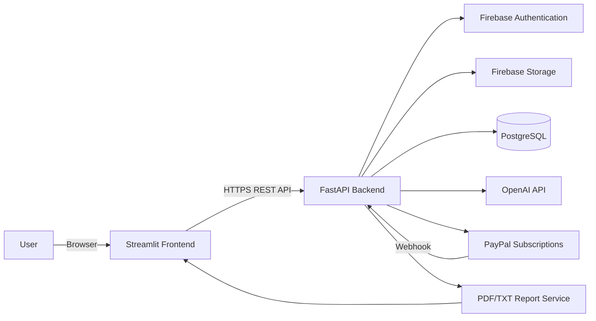
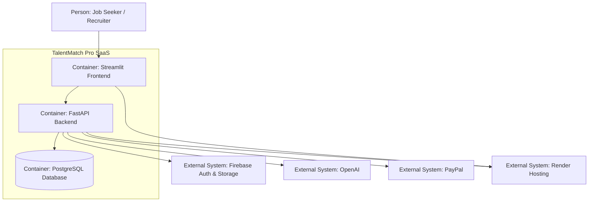
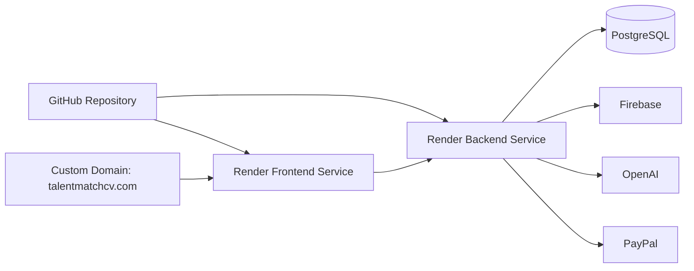
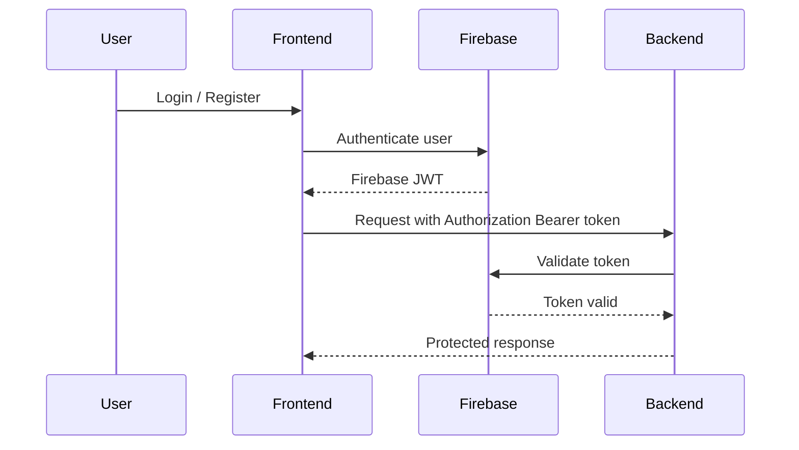
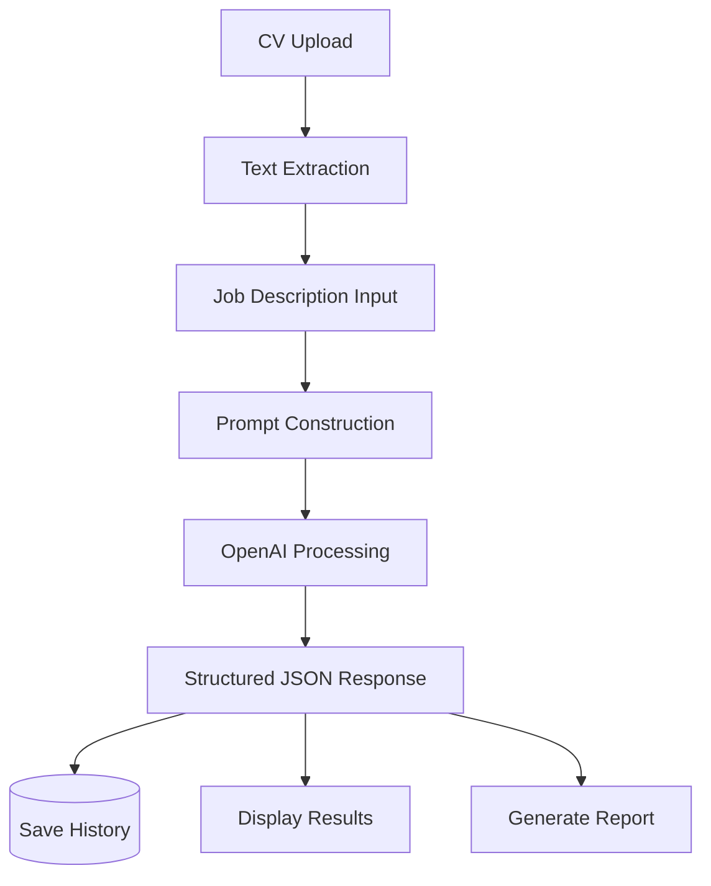
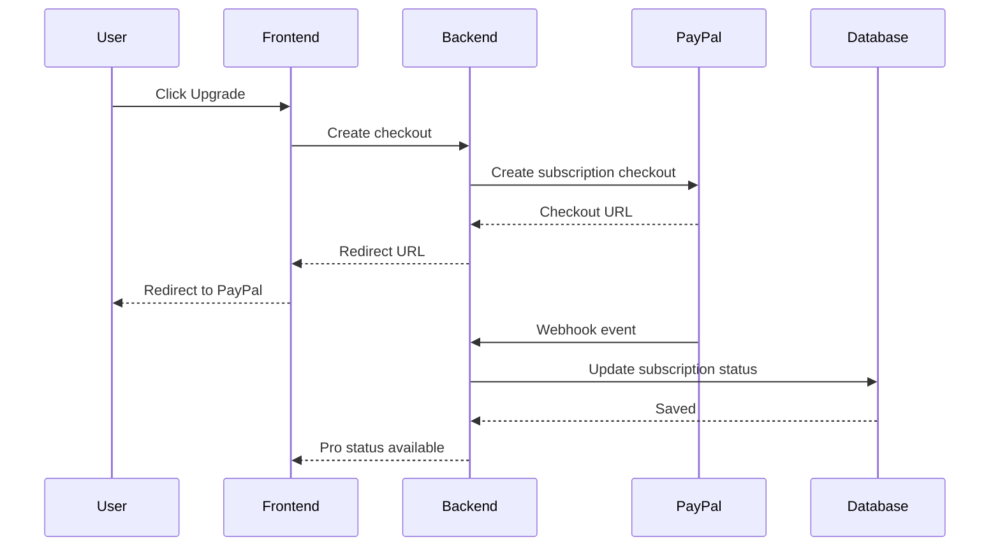
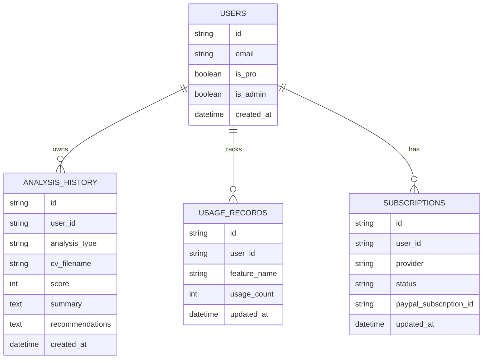
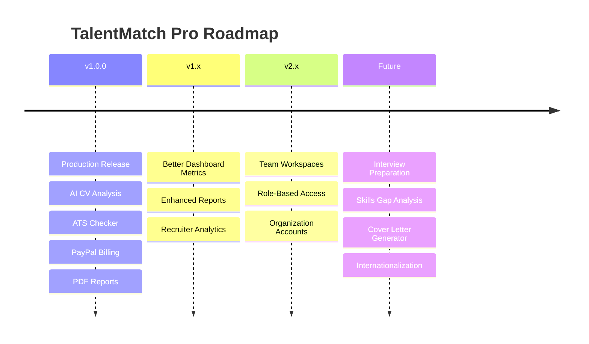

<!--
TalentMatch Pro
Final GitHub Showcase README.md
Production SaaS Portfolio Documentation
-->

<div align="center">

# 🚀 TalentMatch Pro

<p align="center">
  
</p>

### AI-Powered Resume Intelligence & Recruitment Platform

**Analyze resumes. Improve ATS compatibility. Match candidates semantically. Rank applicants. Export professional reports.**

<br />

<a href="https://talentmatchcv.com"><strong>🌐 Live App</strong></a>
&nbsp;&nbsp;•&nbsp;&nbsp;
<a href="https://github.com/dejanjovic1283-ui/talentmatch-pro"><strong>📦 Repository</strong></a>
&nbsp;&nbsp;•&nbsp;&nbsp;
<a href="#-table-of-contents"><strong>📚 Documentation</strong></a>
&nbsp;&nbsp;•&nbsp;&nbsp;
<a href="#-api-reference"><strong>⚡ API</strong></a>

<br />
<br />


</div>

---

## 📌 Project Summary

**TalentMatch Pro** is a production-ready SaaS application for resume analysis, ATS optimization, semantic job matching, recruiter workflows, subscription billing, user history, and professional report generation.

It is built as a real full-stack SaaS product, not as a simple demo.

The platform combines:

- **Streamlit** frontend for the SaaS user interface.
- **FastAPI** backend for secure and reusable API workflows.
- **OpenAI** for AI-powered resume intelligence.
- **PostgreSQL** for persistent analysis history and user-related records.
- **Firebase Authentication** for secure user access.
- **Firebase Storage** for CV file handling.
- **PayPal** for subscription billing.
- **Render** for production deployment.
- **Custom domain** for the public production app.

---

## 🌐 Production URLs

| Resource | URL |
|---|---|
| Production App | https://talentmatchcv.com |
| Frontend Render Service | https://talentmatch-frontend-dejan.onrender.com |
| Backend Render Service | https://talentmatch-backend-1283.onrender.com |
| Repository | https://github.com/dejanjovic1283-ui/talentmatch-pro |
| Health Endpoint | https://talentmatch-backend-1283.onrender.com/healthz |
| Ready Endpoint | https://talentmatch-backend-1283.onrender.com/readyz |

---

## 🧭 Table of Contents

- [Project Summary](#-project-summary)
- [Production URLs](#-production-urls)
- [Product Vision](#-product-vision)
- [Core Features](#-core-features)
- [User Workflows](#-user-workflows)
- [Technology Stack](#-technology-stack)
- [System Architecture](#-system-architecture)
- [C4 Container View](#-c4-container-view)
- [Deployment Architecture](#-deployment-architecture)
- [Authentication Flow](#-authentication-flow)
- [AI Processing Pipeline](#-ai-processing-pipeline)
- [Billing Architecture](#-billing-architecture)
- [Database Model](#-database-model)
- [Folder Structure](#-folder-structure)
- [API Reference](#-api-reference)
- [Request and Response Examples](#-request-and-response-examples)
- [Local Development](#-local-development)
- [Environment Variables](#-environment-variables)
- [Docker](#-docker)
- [Render Deployment](#-render-deployment)
- [Security](#-security)
- [Performance](#-performance)
- [Monitoring and Logging](#-monitoring-and-logging)
- [Testing Strategy](#-testing-strategy)
- [Production Checklist](#-production-checklist)
- [Troubleshooting](#-troubleshooting)
- [Roadmap](#-roadmap)
- [Architecture Decision Records](#-architecture-decision-records)
- [Contributing](#-contributing)
- [License](#-license)
- [Founder](#-founder)
- [Support](#-support)
- [Acknowledgements](#-acknowledgements)
- [Application Showcase](#-application-showcase)
- [Report Gallery](#-report-gallery)
- [Documentation & Assets](#-documentation--assets)
- [Project Statistics](#-project-statistics)
- [Production Highlights](#-production-highlights)
- [Project Showcase](#-project-showcase)
- [Repository Highlights](#-repository-highlights)
- [Why TalentMatch Pro?](#-why-talentmatch-pro)
- [Project Goals](#-project-goals)
- [Built With Passion](#-built-with-passion)

---

## 🎯 Product Vision

TalentMatch Pro is designed to make resume review and candidate evaluation more practical, structured, and explainable.

Instead of giving generic resume advice, TalentMatch Pro evaluates a resume against a specific target job description.

That makes the output useful for:

- job seekers preparing applications,
- recruiters comparing candidates,
- HR teams screening applicants,
- career coaches supporting clients,
- developers reviewing a real SaaS architecture,
- technical reviewers evaluating a production-grade portfolio project.

---

## 📸 Application Showcase

Below are selected screenshots demonstrating the primary TalentMatch Pro workflows and user experience.

---

## 🏠 Dashboard Overview


Production dashboard showing subscription status, available AI tools, quick actions, and workspace overview.

---

## 📊 Dashboard Features


Overview of the main workspace and feature navigation.

---

## 📄 ATS Checker

### Input


### Results


The ATS Checker evaluates keyword coverage, missing skills, and overall ATS compatibility.

---

## ✍️ CV Rewrite

### Input


### Results


AI-assisted resume rewriting while preserving truthful candidate experience.

---

## 🧠 Semantic Match

### Input


### Results


Semantic similarity analysis compares contextual meaning between the resume and the target job description.

---

## 👥 Recruiter Mode

### Candidate Upload


### Candidate Ranking


Recruiters can rank multiple candidates against a single job description.

---

## 📜 Reports & History

### History Overview


### Report Details


Generated reports remain available through the authenticated history page.

---

## 💳 Pricing

### Pricing Overview


### Plan Comparison


TalentMatch Pro uses PayPal subscriptions for production billing.

---

## ⚙️ Account


Users can manage their profile, subscription, and account settings.

---

## ❤️ System Health


Administrative overview showing platform usage and operational status.

---

## 📑 Report Gallery

TalentMatch Pro generates professional downloadable reports for every completed analysis.

Reports are available in both **PDF** and **TXT** formats and are stored in the authenticated user history.

## 📄 Sample PDF Reports

| Report | Description |
|---------|-------------|
| CV Analysis Report | AI-powered resume evaluation |
| ATS Checker Report | ATS compatibility and keyword coverage |
| Semantic Match Report | Contextual resume-to-job comparison |
| Recruiter Ranking Report | Candidate ranking and recruiter insights |
| History Export | Complete user analysis history |

📂 Sample reports:

- [`docs/reports/pdf/`](docs/reports/pdf/)

---

## 📝 Sample TXT Reports

TXT reports contain the same structured analysis in lightweight text format.

📂 Sample reports:

- [`docs/reports/txt/`](docs/reports/txt/)

---

### Report Features

- Professional PDF formatting
- Clean TXT export
- AI-generated summaries
- ATS recommendations
- Semantic analysis
- Recruiter insights
- Downloadable from History
- Production-ready report generation

---

## 📚 Documentation & Assets

TalentMatch Pro includes a complete documentation package located in the `docs/` directory.

This repository contains production-ready documentation, screenshots, sample reports, and architecture diagrams.

## 📂 Documentation Structure

```text
docs/
├── screenshots/
├── reports/
│   ├── pdf/
│   └── txt/
├── architecture/
├── gifs/
└── README-assets/
```

## 📸 Screenshots

Application screenshots:

- Dashboard
- ATS Checker
- CV Rewrite
- Semantic Match
- Recruiter Mode
- Reports
- Pricing
- Account
- System Health

📁 Location:

```text
docs/screenshots/
```

---

## 📑 Reports

Example generated reports:

- PDF Analysis Reports
- TXT Analysis Reports
- History Reports

📁 Location:

```text
docs/reports/
```

---

## 🏗️ Architecture

The complete architecture documentation is available here:

```text
docs/architecture/architecture.md
```

Architecture documentation includes:

- System Architecture
- Deployment Architecture
- Billing Flow
- Mermaid Diagrams

---

## 🎬 GIF Demonstrations

Animated product demonstrations can be stored in:

```text
docs/gifs/
```

---

## 🎨 README Assets

Static assets used by the README:

```text
docs/README-assets/
```

This folder can contain:

- GitHub Banner
- Social Preview
- Icons
- SVG Assets
- Diagrams

---

## 📈 Project Statistics

TalentMatch Pro is designed as a complete production-ready SaaS platform rather than a single-feature AI demo.

| Category | Details |
|----------|---------|
| Project Type | AI SaaS Platform |
| Status | Production |
| Architecture | Full-Stack |
| Frontend | Streamlit |
| Backend | FastAPI |
| Database | PostgreSQL |
| Authentication | Firebase Authentication |
| Storage | Firebase Storage |
| AI Engine | OpenAI |
| Billing | PayPal |
| Deployment | Render |
| Custom Domain | talentmatchcv.com |
| Reports | PDF + TXT |
| Capability | Status |
|------------|--------|
| Resume Analysis | Production |
| ATS Checker | Production |
| Semantic Matching | Production |
| Recruiter Mode | Production |
| PDF Reports | Production |
| TXT Reports | Production |
| Authentication | Production |
| Subscription Billing | Production |

---

## 🚀 Production Highlights

TalentMatch Pro is not a prototype.

It is a fully deployed SaaS application demonstrating modern AI-assisted recruitment workflows.

### Highlights

- Production deployment on Render
- Custom production domain
- Secure Firebase Authentication
- PostgreSQL persistent storage
- OpenAI-powered resume intelligence
- PayPal subscription billing
- AI Resume Analysis
- ATS Optimization
- Semantic Matching
- Recruiter Candidate Ranking
- Downloadable PDF Reports
- Downloadable TXT Reports
- Professional GitHub Documentation
- Complete API Documentation
- Mermaid Architecture Diagrams
- Docker Support
- Production Monitoring
- Security Best Practices

---

## ⭐ Project Showcase

TalentMatch Pro demonstrates a complete end-to-end AI SaaS workflow, from authentication and subscription management to AI-powered resume analysis and professional report generation.

## End-to-End User Journey

```text
User Registration
        │
        ▼
Firebase Authentication
        │
        ▼
Dashboard
        │
        ▼
Upload Resume
        │
        ▼
Paste Job Description
        │
        ▼
Choose AI Workflow
        │
        ├── Resume Analysis
        ├── ATS Checker
        ├── CV Rewrite
        ├── Semantic Match
        └── Recruiter Mode
        │
        ▼
OpenAI Processing
        │
        ▼
Structured Analysis
        │
        ▼
Save History
        │
        ▼
Generate PDF / TXT Report
        │
        ▼
Download Results
```

---

## Available AI Workflows

| Workflow | Status |
|----------|--------|
| Resume Analysis | ✅ |
| ATS Checker | ✅ |
| CV Rewrite | ✅ |
| Semantic Match | ✅ |
| Recruiter Ranking | ✅ |
| Report Generation | ✅ |
| History | ✅ |
| PayPal Billing | ✅ |

---

## 📊 Repository Highlights

TalentMatch Pro was built as a production-oriented software engineering project.

### Highlights

- Production SaaS Architecture
- AI-Powered Resume Intelligence
- FastAPI REST Backend
- Streamlit Frontend
- PostgreSQL Persistence
- Firebase Authentication
- Firebase Storage
- OpenAI Integration
- PayPal Subscription Billing
- Docker Support
- Render Deployment
- Custom Domain
- Professional Documentation
- Architecture Diagrams
- Sample Reports
- Screenshot Gallery

---

## 🌟 Why TalentMatch Pro?

TalentMatch Pro was built to demonstrate how modern AI can support resume optimization and recruitment workflows in a practical, production-ready SaaS application.

Unlike isolated AI demos, TalentMatch Pro combines:

- AI-powered resume intelligence
- ATS optimization
- Semantic matching
- Recruiter workflows
- Subscription billing
- Persistent history
- Professional report generation
- Secure authentication
- Production deployment
- Complete technical documentation

The project emphasizes software architecture, maintainability, security, and user experience while providing realistic end-to-end workflows for both job seekers and recruiters.

---

## 🎯 Project Goals

- Deliver a production-ready AI SaaS platform.
- Demonstrate modern full-stack Python architecture.
- Showcase practical OpenAI integration.
- Provide realistic recruiter and job seeker workflows.
- Follow secure authentication and billing practices.
- Maintain clean documentation and modular code.
- Serve as a portfolio-grade engineering project.

---

## ❤️ Built With Passion

TalentMatch Pro is the result of continuous design, development, testing, deployment, and documentation.

The project demonstrates not only technical implementation but also product thinking, production deployment, maintainability, and long-term scalability.

Every major component—from authentication and AI processing to billing, reporting, and documentation—has been designed as part of a complete SaaS ecosystem.

---

## ✨ Core Features

### 📄 AI Resume Analysis

Analyzes a resume against a job description and returns:

- overall score,
- recruiter-style summary,
- matched strengths,
- missing skills,
- improvement recommendations,
- exportable analysis report,
- history record.

### 🎯 ATS Checker

Evaluates keyword coverage and ATS compatibility.

Returns:

- ATS score,
- matched keywords,
- missing keywords,
- keyword coverage,
- practical improvement advice.

### ✍️ CV Rewrite

Generates AI-assisted CV rewrite guidance.

Focus areas:

- stronger wording,
- better role alignment,
- improved ATS keyword usage,
- truthful positioning,
- clearer professional presentation.

### 🧠 Semantic Match

Compares resume meaning with job description meaning.

This goes beyond exact keyword matching and evaluates contextual alignment.

Returns:

- combined score,
- semantic score,
- keyword score,
- matched themes,
- missing themes,
- recruiter-style verdict.

### 👥 Recruiter Mode

Ranks multiple candidate CVs against one job description.

Returns:

- candidate ranking,
- top candidate,
- score per candidate,
- semantic score,
- keyword score,
- recruiter summaries,
- recommendations,
- CSV export.

### 📜 History

Authenticated users can review previous analyses.

History includes:

- analysis type,
- CV filename,
- score,
- summary,
- recommendations,
- creation date,
- export actions.

### 📄 Professional Reports

TalentMatch Pro supports downloadable reports.

Supported formats:

- TXT reports,
- PDF reports.

PDF reports are generated through the backend and include structured analysis sections.

### 💳 PayPal Billing

TalentMatch Pro uses **PayPal** as the active production billing provider.

The Pro plan unlocks premium workflows such as:

- CV Rewrite,
- Semantic Match,
- Recruiter Mode,
- PDF Reports,
- extended SaaS workflows.

---

## 🧑‍💼 User Workflows

### Job Seeker Workflow

```text
Register / Login
    ↓
Upload CV
    ↓
Paste Job Description
    ↓
Run AI Resume Analysis
    ↓
Review Score and Recommendations
    ↓
Improve Resume
    ↓
Export Report
```

### ATS Optimization Workflow

```text
Upload CV
    ↓
Paste Job Description
    ↓
Run ATS Checker
    ↓
Review Matched Keywords
    ↓
Review Missing Keywords
    ↓
Improve CV Responsibly
```

### Recruiter Workflow

```text
Login
    ↓
Open Recruiter Mode
    ↓
Upload Multiple Candidate CVs
    ↓
Paste Job Description
    ↓
Rank Candidates
    ↓
Export Results
```

### Subscription Workflow

```text
Free User
    ↓
Pricing Page
    ↓
PayPal Checkout
    ↓
Subscription Approval
    ↓
Webhook Processing
    ↓
Pro Features Enabled
```

---

## 🧱 Technology Stack

| Layer | Technology | Purpose |
|---|---|---|
| Frontend | Streamlit | SaaS UI and user workflows |
| Backend | FastAPI | REST API and business logic |
| AI Engine | OpenAI | Resume analysis and semantic intelligence |
| Database | PostgreSQL | History, usage, and subscription state |
| Authentication | Firebase Authentication | Secure login and identity |
| Storage | Firebase Storage | Uploaded CV file handling |
| Billing | PayPal | Subscription checkout and webhooks |
| Hosting | Render | Production frontend/backend deployment |
| Reports | ReportLab / backend report service | PDF export generation |
| Language | Python | Main application language |

---

## 🏗️ System Architecture



### Architecture Principles

- Frontend and backend are separated.
- Backend owns business logic.
- Authentication is validated server-side.
- AI calls are controlled through backend services.
- Billing state is updated through PayPal webhooks.
- History is persisted in PostgreSQL.
- Files are handled through Firebase Storage.
- Secrets are managed through environment variables.

---

## 🧩 C4 Container View



---

## ☁️ Deployment Architecture



---

## 🔐 Authentication Flow



---

## 🧠 AI Processing Pipeline



---

## 💳 Billing Architecture



> **Billing Provider**
>
> PayPal is the active production billing provider for TalentMatch Pro.

---

## 🗄️ Database Model



---

## 📁 Project Folder Structure

```text
talentmatch-pro/
├── backend/
│   ├── billing/
│   │   ├── __init__.py
│   │   ├── factory.py
│   │   ├── paypal_provider.py
│   │   └── provider.py
│   ├── scripts/
│   │   ├── create_paypal_plan.py
│   │   └── set_user_pro.py
│   ├── static/
│   │   ├── robots.txt
│   │   └── sitemap.xml
│   ├── auth.py
│   ├── db.py
│   ├── firebase.py
│   ├── main.py
│   ├── models.py
│   ├── openai_service.py
│   ├── pdf_report.py
│   ├── pdf_utils.py
│   ├── recruiter_service.py
│   ├── schemas.py
│   ├── semantic_service.py
│   ├── storage.py
│   └── usage_service.py
│
├── frontend/
│   ├── assets/
│   │   ├── favicon.png
│   │   └── logo.png
│   ├── components/
│   │   ├── analytics.py
│   │   ├── footer.py
│   │   ├── sidebar.py
│   │   └── ui.py
│   ├── pages/
│   │   ├── about.py
│   │   ├── account.py
│   │   ├── admin_analytics.py
│   │   ├── ats_checker.py
│   │   ├── contact.py
│   │   ├── cv_analysis.py
│   │   ├── cv_rewrite.py
│   │   ├── history.py
│   │   ├── landing.py
│   │   ├── login.py
│   │   ├── pricing.py
│   │   ├── privacy.py
│   │   ├── recruiter_mode.py
│   │   ├── refund.py
│   │   ├── register.py
│   │   ├── semantic_match.py
│   │   └── terms.py
│   ├── .streamlit/
│   │   ├── config.toml
│   │   └── secrets.toml
│   ├── app.py
│   ├── auth_utils.py
│   └── requirements.txt
│
├── docs/
│   ├── architecture/
│   │   └── architecture.md
│   ├── gifs/
│   ├── README-assets/
│   ├── reports/
│   │   ├── pdf/
│   │   ├── txt/
│   │   └── README.md
│   ├── screenshots/
│   └── README.md
│
├── .gitignore
├── docker-compose.yml
├── Dockerfile.backend
├── Dockerfile.frontend
├── get_token.py
├── README.md
└── requirements.txt
```

---

## ⚡ API Reference

Base backend URL:

```text
https://talentmatch-backend-1283.onrender.com
```

### Health Endpoints

| Method | Endpoint | Description |
|---|---|---|
| GET | `/healthz` | Basic health check |
| GET | `/readyz` | Readiness check |

> **Authentication**
>
> All protected endpoints require a valid Firebase Bearer token supplied in the `Authorization` header.
>
> Public endpoints such as `/healthz` and `/readyz` do not require authentication.

### Resume and AI Endpoints

| Method | Endpoint | Description |
|---|---|---|
| POST | `/analyze-resume` | Analyze CV against job description |
| POST | `/ats-check` | Check ATS keyword coverage |
| POST | `/rewrite-cv` | Generate CV rewrite guidance |
| POST | `/semantic-match` | Compare resume and job description semantically |
| POST | `/recruiter/rank-candidates` | Rank multiple candidates |

### History Endpoints

| Method | Endpoint | Description |
|---|---|---|
| GET | `/history` | Get authenticated user history |
| DELETE | `/history/{record_id}` | Delete one history record |
| DELETE | `/history` | Delete all history records |

### Report Endpoints

| Method | Endpoint | Description |
|---|---|---|
| POST | `/reports/analysis-pdf` | Generate PDF report |
| POST | `/reports/analysis-txt` | Generate TXT report |

### Billing Endpoints

| Method | Endpoint | Description |
|---|---|---|
| POST | `/billing/create-checkout` | Create PayPal checkout |
| POST | `/billing/create-portal` | Create billing portal |
| POST | `/billing/webhook` | Generic billing webhook |
| POST | `/paypal/webhook` | PayPal webhook |

---

## 🔁 Request and Response Examples

<details>
<summary><strong>POST /analyze-resume</strong></summary>

### Request

```json
{
  "resume": "Experienced Python developer with FastAPI, PostgreSQL and cloud deployment experience.",
  "job_description": "We are hiring a backend developer with Python, FastAPI, PostgreSQL, REST APIs and production deployment experience."
}
```

### Response

```json
{
  "score": 92,
  "summary": "The resume shows strong alignment with the target backend developer role.",
  "strengths": [
    "Python",
    "FastAPI",
    "PostgreSQL",
    "REST API experience"
  ],
  "gaps": [
    "Docker experience is not clearly described",
    "CI/CD experience could be more visible"
  ],
  "recommendations": [
    "Add one bullet describing production API deployment.",
    "Mention Docker or containerized development if accurate.",
    "Include measurable backend project outcomes."
  ]
}
```

</details>

<details>
<summary><strong>POST /ats-check</strong></summary>

### Request

```json
{
  "resume": "Python developer experienced with APIs and databases.",
  "job_description": "Python, FastAPI, PostgreSQL, Docker, REST API, cloud deployment."
}
```

### Response

```json
{
  "ats_score": 67,
  "coverage_percentage": 67,
  "matched_keywords": [
    "Python",
    "API",
    "databases"
  ],
  "missing_keywords": [
    "FastAPI",
    "PostgreSQL",
    "Docker",
    "cloud deployment"
  ],
  "recommendations": [
    "Add relevant missing keywords only where truthful.",
    "Clarify database technology experience.",
    "Mention deployment experience if applicable."
  ]
}
```

</details>

<details>
<summary><strong>POST /semantic-match</strong></summary>

### Response

```json
{
  "combined_score": 88,
  "semantic_score": 91,
  "keyword_score": 84,
  "verdict": "Strong Match",
  "summary": "The candidate profile is strongly aligned with the target role.",
  "matched_themes": [
    "Backend engineering",
    "API development",
    "Database experience"
  ],
  "missing_themes": [
    "Containerized deployment"
  ],
  "recommendations": [
    "Add specific production deployment details.",
    "Make technical ownership more explicit."
  ]
}
```

</details>

<details>
<summary><strong>POST /recruiter/rank-candidates</strong></summary>

### Response

```json
{
  "ranking": [
    {
      "candidate": "candidate_1.pdf",
      "score": 94,
      "semantic_score": 96,
      "keyword_score": 91,
      "verdict": "Excellent Match"
    },
    {
      "candidate": "candidate_2.pdf",
      "score": 81,
      "semantic_score": 84,
      "keyword_score": 77,
      "verdict": "Good Match"
    }
  ],
  "top_candidate": "candidate_1.pdf"
}
```

</details>

---

## 🧑‍💻 Local Development

### Clone Repository

```bash
git clone https://github.com/dejanjovic1283-ui/talentmatch-pro.git
cd talentmatch-pro
```

### Create Virtual Environment

```bash
python -m venv .venv
```

### Activate Virtual Environment

Windows:

```bash
.venv\Scripts\activate
```

Linux/macOS:

```bash
source .venv/bin/activate
```

### Install Dependencies

```bash
pip install -r requirements.txt
```

### Run Backend

```bash
uvicorn backend.main:app --reload
```

### Run Frontend

```bash
streamlit run frontend/app.py
```

---

## 🔑 Environment Variables

### Backend Environment

```env
DATABASE_URL=
OPENAI_API_KEY=
SECRET_KEY=
FIREBASE_PROJECT_ID=
FIREBASE_STORAGE_BUCKET=
PAYPAL_CLIENT_ID=
PAYPAL_CLIENT_SECRET=
PAYPAL_WEBHOOK_ID=
PAYPAL_ENV=live
BILLING_PROVIDER=paypal
```

### Frontend Environment

```env
BACKEND_URL=https://talentmatch-backend-1283.onrender.com
```

> Never commit real secrets to GitHub.

---

## 🐳 Docker

### Backend

```bash
docker build -t talentmatch-backend ./backend
docker run -p 8000:8000 talentmatch-backend
```

### Frontend

```bash
docker build -t talentmatch-frontend ./frontend
docker run -p 8501:8501 talentmatch-frontend
```

### Docker Compose

```bash
docker compose up --build
```

---

## 🚀 Render Deployment

TalentMatch Pro uses separate Render services.

### Frontend Service

- Type: Web Service
- Runtime: Python
- Framework: Streamlit
- Public URL: `https://talentmatch-frontend-dejan.onrender.com`
- Custom domain: `https://talentmatchcv.com`

### Backend Service

- Type: Web Service
- Runtime: Python
- Framework: FastAPI
- Public URL: `https://talentmatch-backend-1283.onrender.com`

### Deployment Workflow

```text
Local Development
    ↓
Git Commit
    ↓
GitHub Push
    ↓
Render Auto Deploy / Manual Deploy
    ↓
Health Check
    ↓
Production
```

---

## 🛡️ Security

TalentMatch Pro follows production-focused security practices:

- HTTPS-only communication.
- Firebase JWT validation.
- Server-side authorization.
- Protected billing webhooks.
- Environment-managed secrets.
- No hardcoded API keys.
- No secrets committed to GitHub.
- Backend validation for protected workflows.
- Clear separation of user and admin access.
- Admin Analytics hidden from non-admin users.

---

## ⚙️ Performance

Performance practices:

- Stateless backend design.
- Managed PostgreSQL database.
- Service-layer architecture.
- Controlled AI request handling.
- Efficient API request structure.
- Lazy frontend workflows.
- Report generation handled by backend.

Potential future optimizations:

- background jobs,
- request caching,
- async task queues,
- CDN for static assets,
- database indexes,
- queue-based AI processing.

---

## 📊 Monitoring and Logging

Recommended monitoring areas:

- frontend availability,
- backend availability,
- API response time,
- `/healthz` status,
- `/readyz` status,
- OpenAI request errors,
- PayPal webhook events,
- PostgreSQL connectivity,
- authentication failures,
- report generation failures.

Recommended logging:

- request metadata,
- errors and exceptions,
- billing events,
- authentication issues,
- AI processing failures,
- export/report errors.

Sensitive data should never be logged.

---

## 🧪 Testing Strategy

Recommended test coverage:

- authentication validation,
- API endpoints,
- ATS scoring,
- semantic matching,
- recruiter ranking,
- PayPal webhook handling,
- history creation,
- report generation,
- account status,
- protected feature access.

Example:

```bash
pytest
```

---

## ✅ Production Checklist

Before production deployment:

- [ ] Backend builds successfully.
- [ ] Frontend builds successfully.
- [ ] Environment variables are configured.
- [ ] Firebase Authentication works.
- [ ] Firebase Storage works.
- [ ] PostgreSQL connection works.
- [ ] OpenAI API key works.
- [ ] PayPal live credentials are configured.
- [ ] PayPal webhook is configured.
- [ ] `/healthz` returns success.
- [ ] `/readyz` returns success.
- [ ] Free plan workflows work.
- [ ] Pro plan workflows work.
- [ ] PDF reports generate correctly.
- [ ] TXT exports work.
- [ ] History loads correctly.
- [ ] Custom domain works.
- [ ] HTTPS works.
- [ ] Admin-only UI is hidden for standard users.

---

## 🧯 Troubleshooting

<details>
<summary><strong>429 Too Many Requests</strong></summary>

Possible causes:

- OpenAI usage limit,
- backend rate limit,
- repeated requests,
- temporary provider restriction.

Recommended actions:

- check backend logs,
- reduce repeated submissions,
- verify API limits,
- implement exponential backoff.

</details>

<details>
<summary><strong>502 Bad Gateway</strong></summary>

Possible causes:

- backend service sleeping,
- deployment failure,
- startup exception,
- missing environment variable.

Recommended actions:

- check Render logs,
- verify environment variables,
- restart backend service,
- confirm `/healthz` and `/readyz`.

</details>

<details>
<summary><strong>History returns HTML instead of JSON</strong></summary>

Possible causes:

- wrong backend URL,
- frontend calling frontend route instead of API route,
- backend service unavailable.

Recommended actions:

- confirm `BACKEND_URL`,
- inspect network request,
- verify backend endpoint response.

</details>

<details>
<summary><strong>PayPal checkout does not open</strong></summary>

Possible causes:

- missing PayPal credentials,
- invalid plan ID,
- wrong environment,
- webhook misconfiguration.

Recommended actions:

- verify `PAYPAL_ENV=live`,
- check PayPal app credentials,
- check subscription plan,
- review backend billing logs.

</details>

---

## 🗺️ Roadmap



---

## 🧾 Architecture Decision Records

### ADR-001: FastAPI Backend

FastAPI was selected for the backend because it provides modern Python API development, strong typing support, automatic documentation, and excellent performance.

### ADR-002: Streamlit Frontend

Streamlit was selected for rapid SaaS interface development and efficient delivery of AI-powered workflows.

### ADR-003: PostgreSQL Database

PostgreSQL was selected for persistent storage of analysis history, user data, usage records, and subscription-related state.

### ADR-004: Firebase Authentication

Firebase Authentication was selected to provide secure and reliable user login/register flows.

### ADR-005: OpenAI AI Engine

OpenAI was selected as the AI provider for resume analysis, semantic matching, rewrite workflows, and recruiter-style summaries.

### ADR-006: PayPal Billing

PayPal was selected as the production billing provider for TalentMatch Pro subscriptions.

### ADR-007: Render Deployment

Render was selected for deploying separate frontend and backend production services with managed environment configuration.

---

## 🤝 Contributing

Contributions are welcome.

Recommended workflow:

```bash
git checkout -b feature/your-feature-name
git add .
git commit -m "feat: add your feature"
git push origin feature/your-feature-name
```

Then open a pull request with:

- clear description,
- screenshots if UI-related,
- test notes,
- migration notes if applicable.

---

## 📜 License

This project is distributed under the MIT License unless otherwise specified.

---

## 👤 Founder

**Dejan Jović**

Founder and developer of TalentMatch Pro.

TalentMatch Pro was created as a practical AI SaaS product and portfolio-grade engineering project focused on resume intelligence, recruitment workflows, and production deployment.

---

## 📬 Support

For product support:

```text
support@talentmatchcv.com
```

For technical issues:

- GitHub Issues
- GitHub Discussions
- Repository documentation

---

## 🙏 Acknowledgements

TalentMatch Pro is built with:

- FastAPI
- Streamlit
- PostgreSQL
- Firebase
- OpenAI
- PayPal
- Render
- Python ecosystem

---

<div align="center">

## ⭐ TalentMatch Pro

**AI-powered resume intelligence for job seekers, recruiters and hiring teams.**

If this project is useful or interesting, consider giving it a star on GitHub.

</div>

---

## Appendix 1: Module Responsibility Matrix

This matrix explains how responsibilities are separated across the frontend, backend, AI layer, billing layer, and persistence layer.

### Checklist

- Keep implementation modular.
- Preserve API compatibility where possible.
- Document important decisions.
- Avoid committing secrets.
- Validate production configuration.
- Test critical user workflows.
- Review logs after deployment.
- Confirm billing and authentication flows.

### Notes

TalentMatch Pro should continue to evolve as a clean, explainable and production-ready SaaS system. Every new module should fit into the existing architecture instead of bypassing it.


---

## Appendix 2: Operational Runbook

This runbook describes practical production operations, including deployment checks, incident response, rollback thinking, and smoke testing.

### Checklist

- Keep implementation modular.
- Preserve API compatibility where possible.
- Document important decisions.
- Avoid committing secrets.
- Validate production configuration.
- Test critical user workflows.
- Review logs after deployment.
- Confirm billing and authentication flows.

### Notes

TalentMatch Pro should continue to evolve as a clean, explainable and production-ready SaaS system. Every new module should fit into the existing architecture instead of bypassing it.


---

## Appendix 3: Quality Standards

These standards define how new features should be implemented, reviewed, tested, and documented before release.

### Checklist

- Keep implementation modular.
- Preserve API compatibility where possible.
- Document important decisions.
- Avoid committing secrets.
- Validate production configuration.
- Test critical user workflows.
- Review logs after deployment.
- Confirm billing and authentication flows.

### Notes

TalentMatch Pro should continue to evolve as a clean, explainable and production-ready SaaS system. Every new module should fit into the existing architecture instead of bypassing it.


---

## Appendix 4: Release Notes Policy

Each production release should clearly document user-facing changes, backend changes, billing changes, and migration notes.

### Checklist

- Keep implementation modular.
- Preserve API compatibility where possible.
- Document important decisions.
- Avoid committing secrets.
- Validate production configuration.
- Test critical user workflows.
- Review logs after deployment.
- Confirm billing and authentication flows.

### Notes

TalentMatch Pro should continue to evolve as a clean, explainable and production-ready SaaS system. Every new module should fit into the existing architecture instead of bypassing it.


---

## Appendix 5: Portfolio Review Notes

TalentMatch Pro is intentionally documented as a portfolio-grade SaaS application that demonstrates product thinking, technical architecture, and production deployment.

### Checklist

- Keep implementation modular.
- Preserve API compatibility where possible.
- Document important decisions.
- Avoid committing secrets.
- Validate production configuration.
- Test critical user workflows.
- Review logs after deployment.
- Confirm billing and authentication flows.

### Notes

TalentMatch Pro should continue to evolve as a clean, explainable and production-ready SaaS system. Every new module should fit into the existing architecture instead of bypassing it.
