<!--
TalentMatch Pro
v3.0 FINAL — Production & Portfolio README
-->

<div align="center">

# 🚀 TalentMatch Pro

<p align="center">
  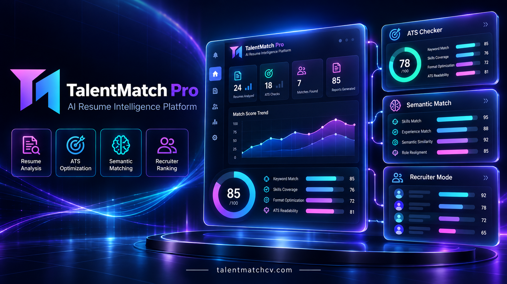
</p>

### AI-Powered Resume Intelligence & Recruitment Platform

**Analyze resumes. Improve ATS compatibility. Match candidates semantically. Rank applicants. Manage candidate intelligence. Export professional reports.**

<br />

<a href="https://talentmatchcv.com"><strong>🌐 Live App</strong></a>
&nbsp;&nbsp;•&nbsp;&nbsp;
<a href="https://api.talentmatchcv.com"><strong>⚡ Production API</strong></a>
&nbsp;&nbsp;•&nbsp;&nbsp;
<a href="https://github.com/dejanjovic1283-ui/talentmatch-pro"><strong>📦 Repository</strong></a>

<br />
<br />


</div>

---

## 📌 Executive Overview

**TalentMatch Pro** is a production AI SaaS platform for resume intelligence, ATS optimization, semantic job matching, recruiter workflows, candidate management, subscription billing, multilingual UX, persistent analysis history, and professional report generation.

It is built as a real end-to-end SaaS product rather than a single-feature AI demo.

The platform combines:

- **Streamlit** for the user-facing SaaS experience.
- **FastAPI** for secure API and business workflows.
- **OpenAI** for resume intelligence, rewrite assistance, semantic scoring, and recruiter analysis.
- **PostgreSQL** for persistent production data.
- **Firebase Authentication** for user identity and protected access.
- **Firebase Storage** for file-oriented workflows.
- **PayPal** as the only production billing provider.
- **ReportLab** for professional PDF generation.
- **Docker** for reproducible production runtimes.
- **Render** for frontend, backend, and managed PostgreSQL deployment.
- **Cloudflare-backed custom domains** for public production access.

---

## 🌐 Production URLs

| Resource | URL |
|---|---|
| Production App | https://talentmatchcv.com |
| Production API | https://api.talentmatchcv.com |
| API Documentation | https://api.talentmatchcv.com/docs |
| Frontend Render Service | https://talentmatch-frontend-dejan.onrender.com |
| Backend Render Service | https://talentmatch-backend-1283.onrender.com |
| Repository | https://github.com/dejanjovic1283-ui/talentmatch-pro |
| Frontend Health | https://talentmatchcv.com/_stcore/health |
| Backend Health | https://api.talentmatchcv.com/healthz |
| Backend Readiness | https://api.talentmatchcv.com/readyz |
| Sitemap | https://talentmatchcv.com/sitemap.xml |
| Robots | https://talentmatchcv.com/robots.txt |

---

## 🧭 Table of Contents

- [Executive Overview](#-executive-overview)
- [Production URLs](#-production-urls)
- [What TalentMatch Pro Solves](#-what-talentmatch-pro-solves)
- [v3.0 FINAL Highlights](#-v30-final-highlights)
- [Core Product Modules](#-core-product-modules)
- [Internationalization](#-internationalization)
- [Theme System](#-theme-system)
- [Professional Reporting](#-professional-reporting)
- [Application Showcase](#-application-showcase)
- [Technology Stack](#-technology-stack)
- [System Architecture](#-system-architecture)
- [Authentication](#-authentication)
- [AI Processing](#-ai-processing)
- [Billing](#-billing)
- [Data & Persistence](#-data--persistence)
- [Docker Production Architecture](#-docker-production-architecture)
- [Render Deployment](#-render-deployment)
- [Security](#-security)
- [Performance & Reliability](#-performance--reliability)
- [Observability](#-observability)
- [Health & Readiness](#-health--readiness)
- [SEO & Domain Configuration](#-seo--domain-configuration)
- [Production Acceptance](#-production-acceptance)
- [API Overview](#-api-overview)
- [Local Development](#-local-development)
- [Environment Configuration](#-environment-configuration)
- [Repository Structure](#-repository-structure)
- [Sample Reports](#-sample-reports)
- [Architecture Documentation](#-architecture-documentation)
- [Release Status](#-release-status)
- [Founder](#-founder)
- [Support](#-support)

---

## 🎯 What TalentMatch Pro Solves

TalentMatch Pro helps job seekers and recruiters evaluate resume-to-role alignment in a structured, explainable workflow.

Instead of returning generic resume advice, the platform works against a specific target job description and combines multiple signals:

- resume quality,
- ATS keyword coverage,
- contextual semantic alignment,
- recruiter-style strengths and gaps,
- rewrite guidance,
- candidate ranking,
- persistent history,
- downloadable evidence-rich reports.

This makes the platform useful for:

- job seekers preparing targeted applications,
- recruiters comparing candidates,
- HR and talent teams screening applicants,
- career coaches supporting clients,
- technical reviewers evaluating a real production Python SaaS architecture.

---

## 🚀 v3.0 FINAL Highlights

TalentMatch Pro v3.0 FINAL represents the completed production hardening and portfolio release of the platform.

### Product

- AI CV Analysis
- ATS Checker
- CV Rewrite
- Semantic Match
- Recruiter Mode
- Candidate Database integrated into the recruiter workflow
- History and report archive
- Admin Analytics
- PayPal production subscriptions
- Professional CSV / TXT / PDF exports

### User Experience

- 12 production locales
- Dark theme
- Light theme
- System theme
- Theme-aware enterprise UI
- Production-ready account and pricing workflows
- Responsive Streamlit workspace

### Platform Engineering

- Dockerized frontend runtime
- Dockerized backend runtime
- PostgreSQL production persistence
- Firebase Authentication and Storage
- OpenAI reliability controls
- Request IDs and structured logging
- Health/readiness endpoints
- Rate limiting
- Security headers
- ETag and conditional GET
- GZip compression
- Cache-Control policies
- Graceful degradation and external-service circuit breakers
- Unified multilingual Unicode PDF engine

---

## ✨ Core Product Modules

### 📄 CV Analysis

Evaluates a resume against a target job description and returns structured recruiter-style intelligence.

Typical output includes:

- overall score,
- executive summary,
- strengths,
- gaps,
- priority recommendations,
- job description appendix,
- TXT/PDF exports,
- persistent History record.

### 🎯 ATS Checker

Evaluates resume keyword coverage and ATS-oriented alignment.

Outputs include:

- ATS score,
- matched keywords,
- missing keywords,
- coverage insight,
- improvement recommendations,
- TXT/PDF exports.

### ✍️ CV Rewrite

Produces targeted rewrite guidance while preserving truthful candidate experience.

Focus areas include:

- stronger headline,
- improved professional summary,
- rewritten experience bullets,
- ATS keyword integration,
- cautions against unsupported claims,
- TXT/PDF export.

### 🧠 Semantic Match

Combines contextual semantic similarity with keyword alignment.

Outputs include:

- overall score,
- semantic score,
- keyword score,
- matched themes,
- missing themes,
- matched/missing keywords,
- recruiter-style interpretation,
- priority recommendations,
- TXT/PDF export.

### 👥 Recruiter Mode

Recruiter Mode evaluates one or more candidates against a shared target job description.

Capabilities include:

- candidate upload and batch ranking,
- overall / semantic / keyword scoring,
- recruiter verdicts,
- candidate summaries,
- strengths and gaps,
- candidate-specific recommendations,
- overall recruiter recommendations,
- CSV export,
- TXT export,
- PDF export,
- saving candidates into Candidate Database.

### 🗂️ Candidate Database

Candidate Database belongs to the **Recruiter Workspace / Recruiter Mode** and provides persistent candidate intelligence for recruiter workflows.

It supports:

- saving analyzed candidates,
- reviewing stored candidate data,
- recruiter-oriented organization,
- reuse of candidate intelligence across hiring workflows.

### 📜 History

Authenticated users can review prior analysis activity and export historical intelligence.

History supports:

- analysis type filtering,
- search and sorting,
- score and status display,
- individual record actions,
- TXT export,
- PDF export,
- multi-record History PDF generation,
- record deletion,
- delete-all workflow,
- pagination.

### 📊 Admin Analytics

Admin Analytics provides production metrics backed by real application data.

Highlights include:

- subscriber intelligence,
- paid subscriber calculations,
- MRR calculation,
- scored analysis counts,
- product usage distribution,
- production-oriented KPI presentation,
- admin-only visibility.

---

## 🌍 Internationalization

TalentMatch Pro v3.0 FINAL ships with 12 active production locales:

| # | Language | Locale |
|---:|---|---|
| 1 | English (UK) | `en` |
| 2 | English (US) | `en_us` |
| 3 | Srpski — Latinica | `sr_latn` |
| 4 | Deutsch | `de` |
| 5 | Français | `fr` |
| 6 | Español | `es` |
| 7 | Italiano | `it` |
| 8 | Português (Brasil) | `pt_br` |
| 9 | Nederlands | `nl` |
| 10 | Русский | `ru` |
| 11 | 简体中文 | `zh_cn` |
| 12 | العربية (UAE) | `ar_ae` |

The multilingual system includes production UI translation coverage for the language selector, navigation, landing experience, and supporting locale infrastructure.

---

## 🌓 Theme System

TalentMatch Pro supports:

- **Dark**
- **Light**
- **System**

The final UI acceptance covered all three modes in production, including key analysis, reporting, recruiter, history, pricing, and account workflows.

---

## 📑 Professional Reporting

TalentMatch Pro uses a unified report architecture for production exports.

### Final PDF modules

1. CV Analysis
2. ATS Checker
3. CV Rewrite
4. Semantic Match
5. Recruiter Mode
6. History

### Unicode support

The production PDF runtime supports multilingual output with:

- Noto Sans,
- Noto Sans Arabic,
- Droid Sans Fallback for CJK coverage,
- Arabic reshaping,
- bidi rendering for RTL text.

The Docker runtime installs required system fonts directly so PDF generation is reproducible across local and Render environments.

### Export formats

- PDF
- TXT
- CSV where appropriate to the workflow

### Report characteristics

- shared visual structure,
- module-specific accent styling,
- compact professional spacing,
- score/status consistency,
- structured recommendations,
- job description appendices,
- Unicode multilingual support.

---

## 📸 Application Showcase

The public showcase uses the final 12 screenshots captured from the current production UI.

The complete source capture set is also retained under `docs/screenshots/source/`, organized by workflow. The source panels support the visual handoff and are not presented as the public showcase.

### Dashboard

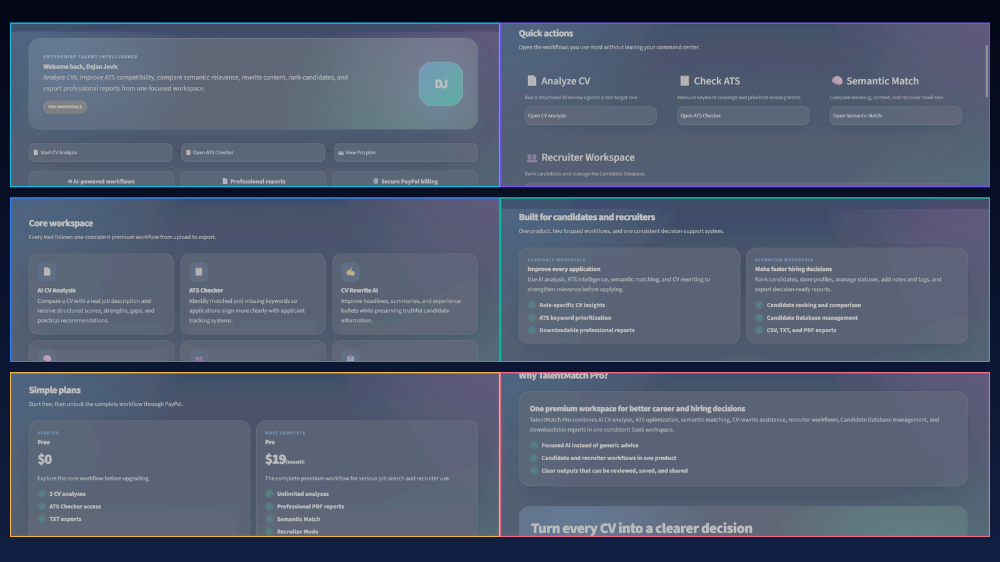

Production workspace overview with user context, feature access, and navigation.

### CV Analysis

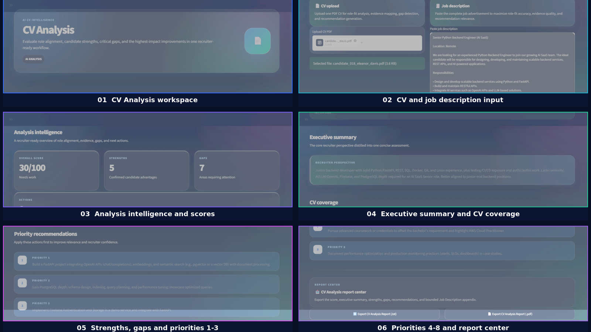

Resume analysis workflow with score, findings, and export-ready results.

### ATS Checker

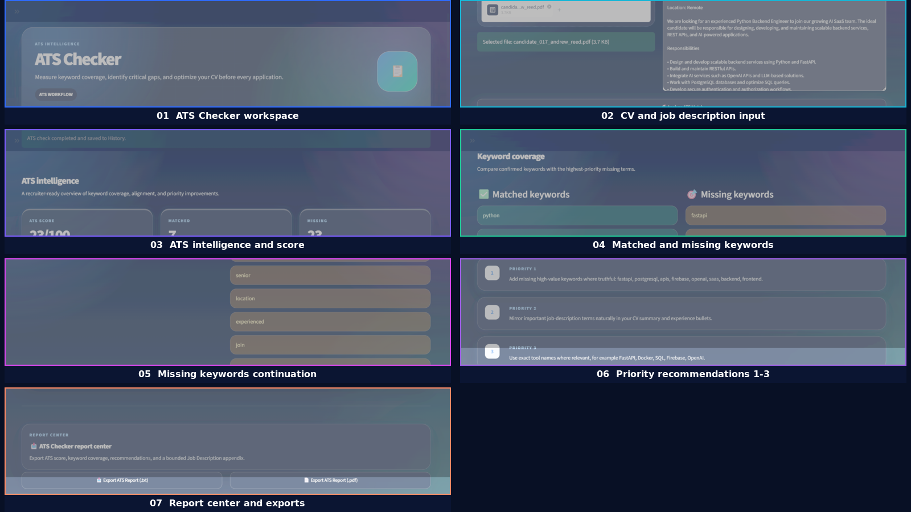

ATS-oriented score, matched keywords, missing keywords, and recommendations.

### CV Rewrite

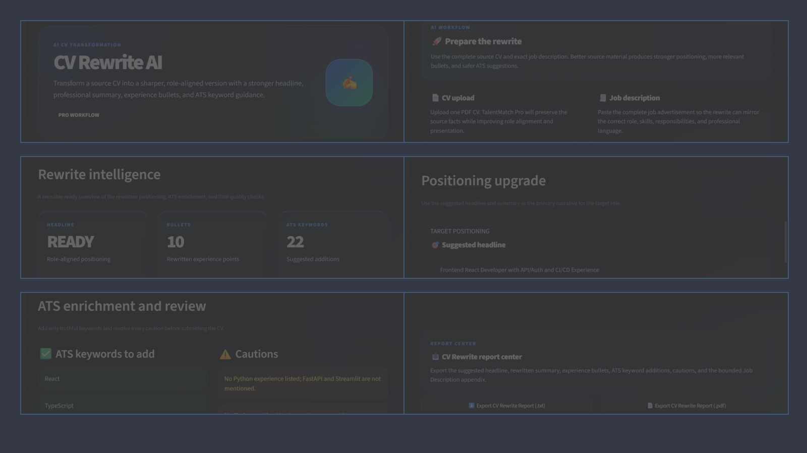

Role-aligned CV rewriting workflow with ATS enrichment, cautions, and export-ready output.

### Semantic Match

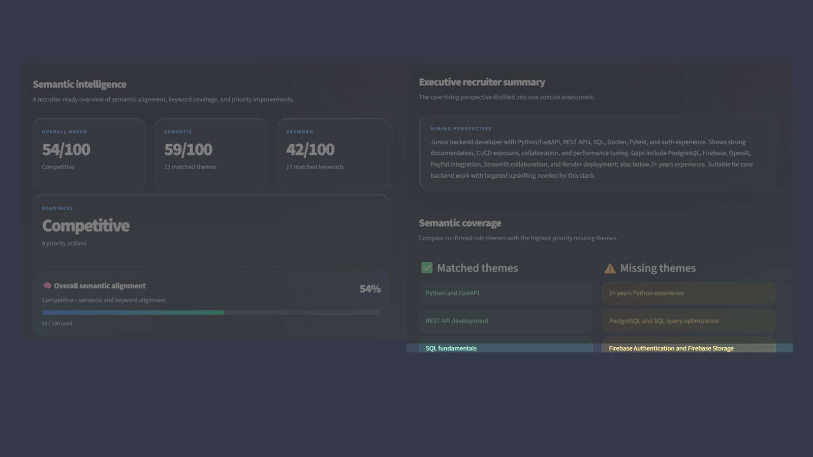

Semantic, keyword, and overall-match intelligence for role and candidate relevance.

### Recruiter Mode

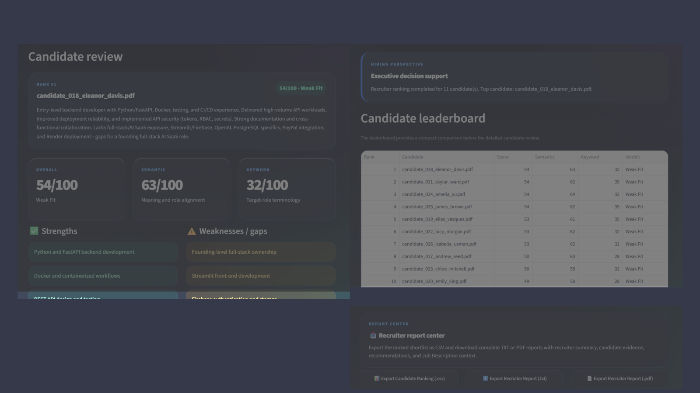

Candidate ranking, strengths, gaps, leaderboard, and recruiter report exports.

### Candidate Database

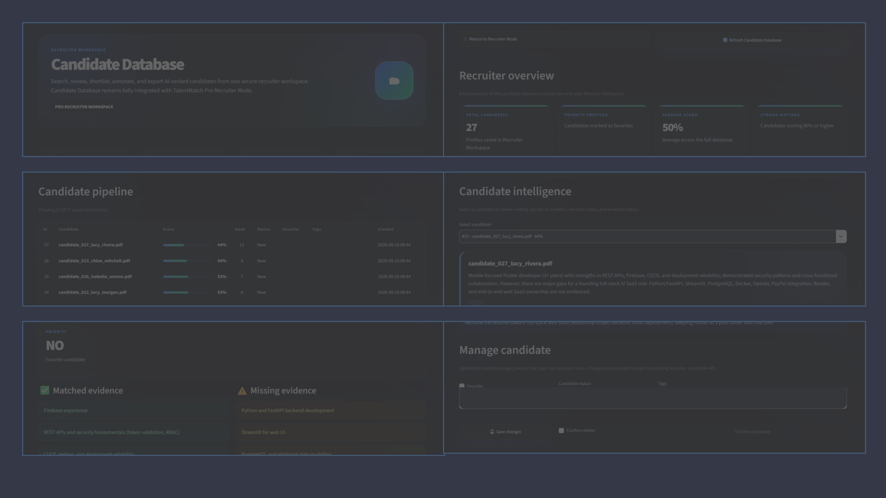

Recruiter candidate pipeline, candidate intelligence, evidence, notes, and controls.

### History

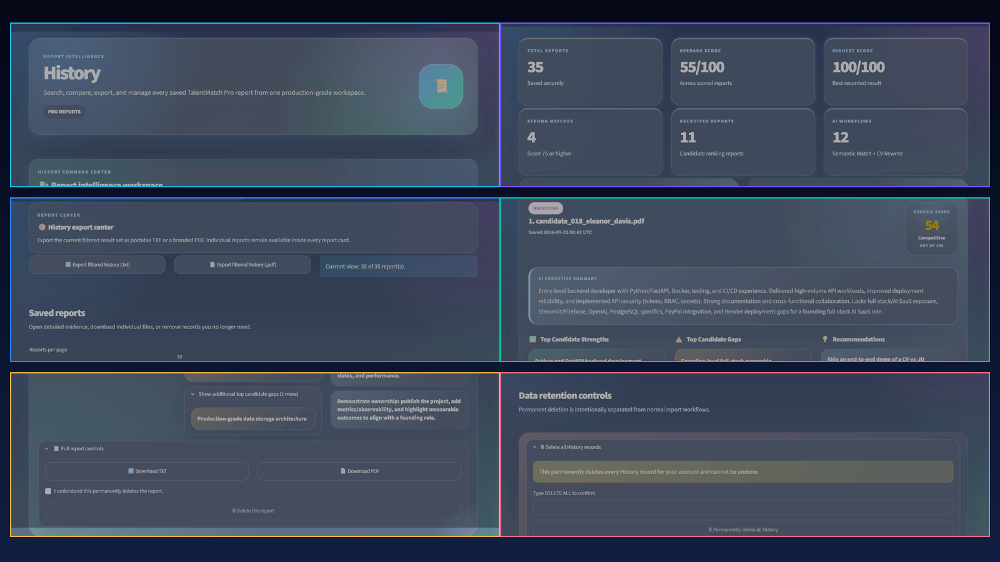

Saved report history with filtering, exports, report detail, and retention controls.

### Pricing

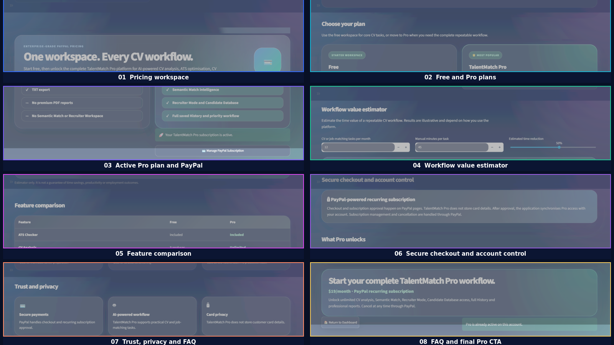

Free and Pro plan comparison, $19/month PayPal subscription, value estimator, and trust details.

### Account

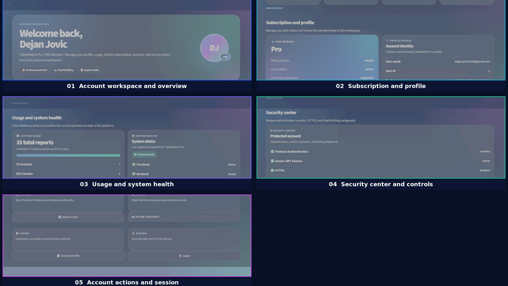

Account workspace with Pro membership, usage, system health, security, and session controls.

### Secure Login Session

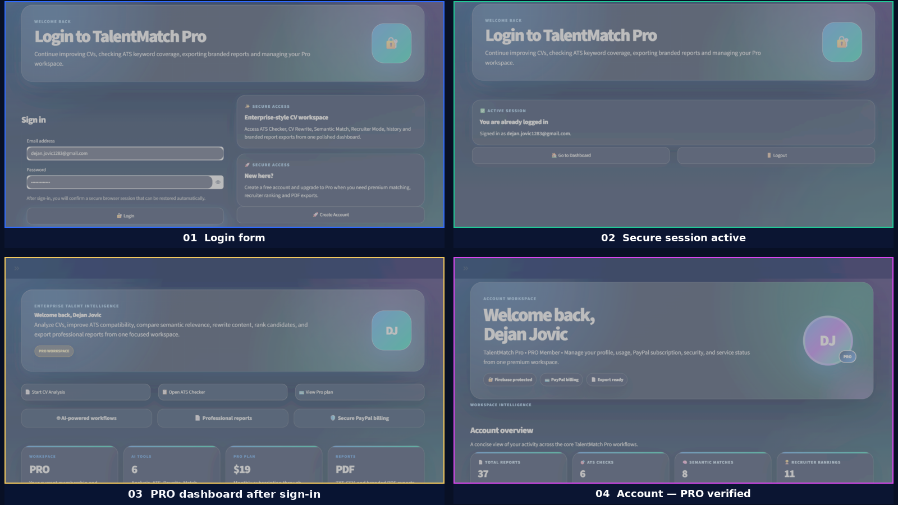

Login, active secure session, Pro dashboard access, and verified account state.

### SEO Indexing

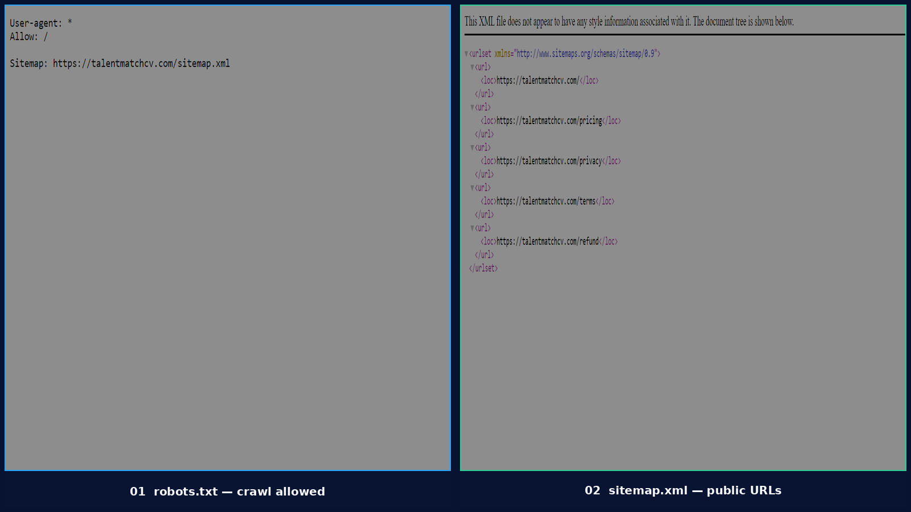

Public robots.txt and sitemap.xml routes used for crawl and indexing readiness.

All 12 files are current production captures. Legacy screenshot names are intentionally excluded. The complete current source set is retained in the organized `docs/screenshots/source/` folders.

---

## 🧱 Technology Stack

| Layer | Technology | Purpose |
|---|---|---|
| Frontend | Streamlit | SaaS UI and interactive workflows |
| Backend | FastAPI | API, business logic, security, orchestration |
| AI | OpenAI | Resume intelligence and semantic analysis |
| Database | PostgreSQL | Production persistence |
| Local Database | SQLite | Local development where configured |
| Authentication | Firebase Authentication | User identity and protected access |
| Storage | Firebase Storage | File-oriented storage workflows |
| Billing | PayPal | Production subscriptions |
| PDF | ReportLab | Professional report generation |
| Containers | Docker | Reproducible local and production runtime |
| Hosting | Render | Frontend, backend, managed PostgreSQL |
| Language | Python 3.13 runtime | Main application language |

---

## 🏗️ System Architecture

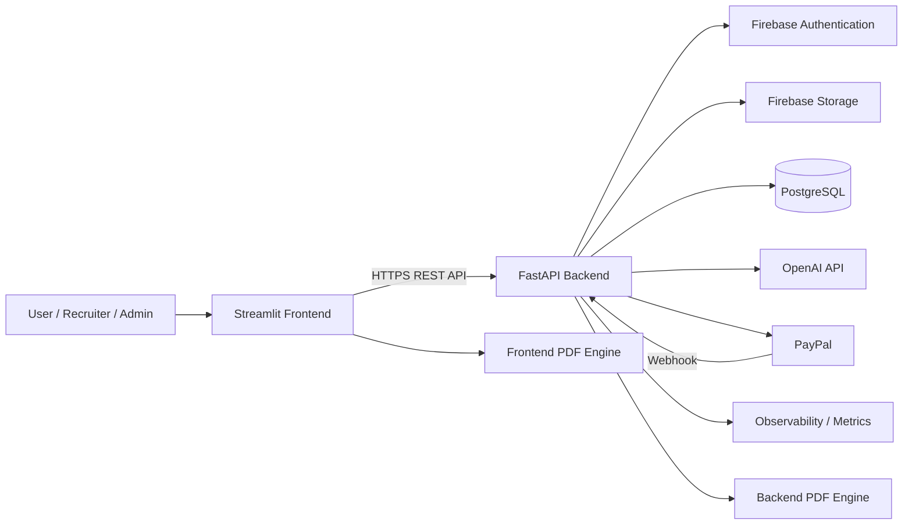
```mermaid
flowchart LR
    U[User / Recruiter / Admin] --> FE[Streamlit Frontend]

    FE -->|HTTPS REST API| BE[FastAPI Backend]

    BE --> AUTH[Firebase Authentication]
    BE --> STORAGE[Firebase Storage]
    BE --> DB[(PostgreSQL)]
    BE --> AI[OpenAI API]
    BE --> PP[PayPal]
    BE --> OBS[Observability / Metrics]

    FE --> FPDF[Frontend PDF Engine]
    BE --> BPDF[Backend PDF Engine]

    PP -->|Webhook| BE
```

### Architectural principles

- Frontend and backend remain separately deployable.
- Backend owns protected business logic.
- Firebase tokens are validated server-side.
- AI calls are centralized through service-layer integrations.
- PayPal is the only billing provider.
- PostgreSQL stores production application state.
- Candidate Database remains inside the recruiter domain.
- Report generation uses shared, production-tested PDF infrastructure.
- Configuration and secrets are environment-driven.

---

## 🔐 Authentication

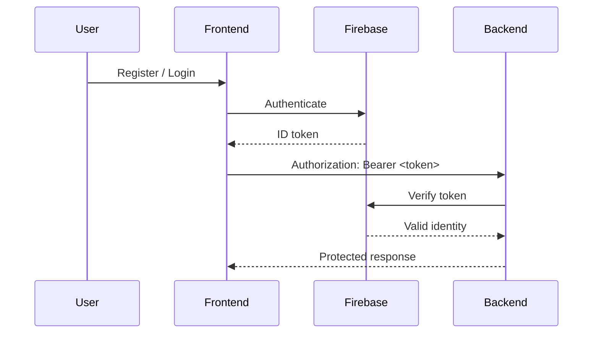
```mermaid
sequenceDiagram
    participant User
    participant Frontend
    participant Firebase
    participant Backend

    User->>Frontend: Register / Login
    Frontend->>Firebase: Authenticate
    Firebase-->>Frontend: ID token
    Frontend->>Backend: Authorization: Bearer <token>
    Backend->>Firebase: Verify token
    Firebase-->>Backend: Valid identity
    Backend-->>Frontend: Protected response
```

Production authorization keeps standard user and admin capabilities separate, including admin-only analytics visibility.

---

## 🧠 AI Processing

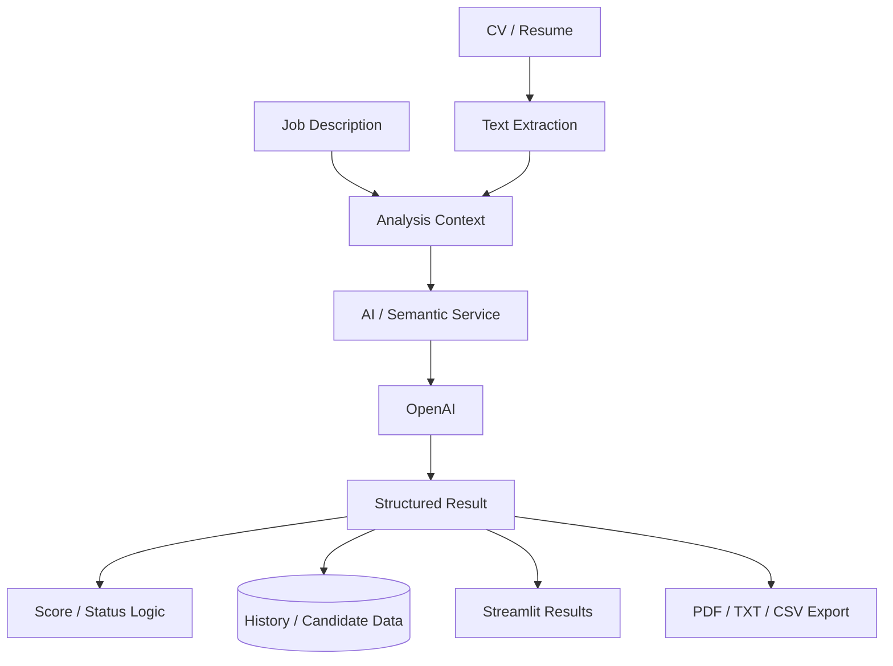
```mermaid
flowchart TD
    CV[CV / Resume] --> Extract[Text Extraction]
    JD[Job Description] --> Context[Analysis Context]
    Extract --> Context
    Context --> Service[AI / Semantic Service]
    Service --> OpenAI[OpenAI]
    OpenAI --> Structured[Structured Result]
    Structured --> Score[Score / Status Logic]
    Structured --> DB[(History / Candidate Data)]
    Structured --> UI[Streamlit Results]
    Structured --> Report[PDF / TXT / CSV Export]
```

Production reliability controls include configurable timeouts, retries where appropriate, validation, observability, and circuit-breaker state for external services.

---

## 💳 Billing

TalentMatch Pro uses **PayPal only** for billing.

### Production Pro plan

**$19 / month**

The production billing flow includes:

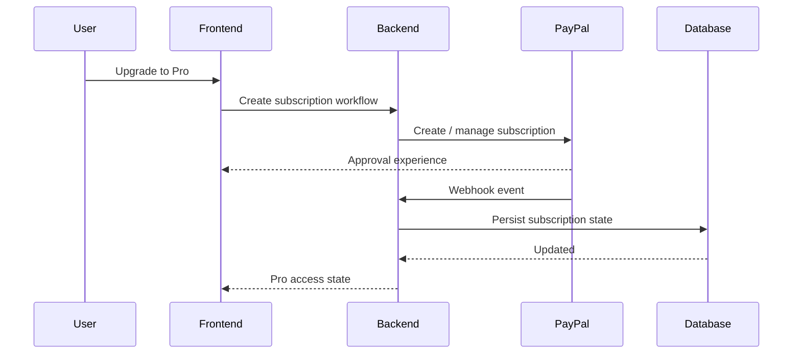
```mermaid
sequenceDiagram
    participant User
    participant Frontend
    participant Backend
    participant PayPal
    participant Database

    User->>Frontend: Upgrade to Pro
    Frontend->>Backend: Create subscription workflow
    Backend->>PayPal: Create / manage subscription
    PayPal-->>Frontend: Approval experience
    PayPal->>Backend: Webhook event
    Backend->>Database: Persist subscription state
    Database-->>Backend: Updated
    Backend-->>Frontend: Pro access state
```

Production readiness checks confirmed PayPal live configuration, plan configuration, webhook configuration, and closed circuit-breaker state.

---

## 🗄️ Data & Persistence

PostgreSQL is the production database and stores application data used by authenticated workflows.

Core persisted domains include:

- user state,
- subscription state,
- usage state,
- analysis history,
- recruiter/candidate data,
- admin analytics inputs.

SQLite may be used for local development where configured, while production configuration validation requires PostgreSQL.

---

## 🐳 Docker Production Architecture

TalentMatch Pro v3.0 FINAL uses Docker for both Render web services.

### Backend runtime

`backend/Dockerfile` provides:

- Python 3.13 slim runtime,
- production dependencies,
- Noto / Droid fallback font installation,
- non-root application user,
- health check against `/healthz`,
- Uvicorn production start command.

### Frontend runtime

`frontend/Dockerfile` provides:

- Python 3.13 slim runtime,
- Streamlit dependencies,
- Noto / Droid fallback font installation,
- non-root application user,
- health check against `/_stcore/health`,
- Streamlit production start command.

### Local orchestration

```bash
docker compose up --build
```

Docker is also used as the final local verification layer before production deployment when runtime changes are introduced.

---

## ☁️ Render Deployment

TalentMatch Pro uses separate Render services with service-specific root directories and Docker runtimes.

### Frontend

- Service: `talentmatch-frontend-dejan`
- Root directory: `frontend`
- Runtime: Docker
- Custom domain: `https://talentmatchcv.com`

### Backend

- Service: `talentmatch-backend-1283`
- Root directory: `backend`
- Runtime: Docker
- Custom API domain: `https://api.talentmatchcv.com`

### Database

- Managed PostgreSQL production database

### Deployment flow

```text
Production-ready change
        ↓
Local validation
        ↓
Docker validation
        ↓
Git review
        ↓
Commit and push
        ↓
Render deploy
        ↓
Health / readiness verification
        ↓
Production smoke test
        ↓
Runtime log review
```

---

## 🛡️ Security

Production hardening includes:

- HTTPS redirect support,
- HSTS,
- Trusted Host validation,
- Firebase token verification,
- server-side authorization,
- request IDs,
- standardized JSON errors,
- no stack traces returned to clients,
- production exception handling,
- rate limiting,
- secret/configuration validation,
- no secret logging,
- secure billing webhook handling,
- admin-only authorization boundaries,
- security response headers.

Verified production headers include:

- `Content-Security-Policy`
- `Strict-Transport-Security`
- `X-Content-Type-Options`
- `X-Frame-Options`
- `Referrer-Policy`
- `Permissions-Policy`
- `Cross-Origin-Opener-Policy`
- `Cross-Origin-Resource-Policy`

---

## ⚙️ Performance & Reliability

Production performance and reliability features include:

- GZip compression,
- ETag generation,
- conditional GET support,
- `304 Not Modified` capability,
- Cache-Control policies,
- structured request timing,
- database timeout protection,
- transaction safety,
- external-service retries where configured,
- graceful degradation,
- circuit breakers,
- API reliability controls.

Score/status logic is standardized across relevant product areas:

- **75–100** → Strong
- **50–74** → Competitive
- **0–49** → Needs work

---

## 📊 Observability

The backend exposes production observability features including:

- uptime,
- request counters,
- success/error counters,
- duration metrics,
- AI service metrics,
- database status,
- runtime state,
- external service circuit state,
- structured request-completion logs,
- request ID correlation.

Production logs were reviewed after final frontend and backend smoke testing with no application `ERROR`, `CRITICAL`, traceback, unhandled exception, or PDF font failure in the accepted flows.

---

## ❤️ Health & Readiness

### Frontend

```text
GET https://talentmatchcv.com/_stcore/health
```

Expected accepted response:

```text
200 OK
ok
```

### Backend health

```text
GET https://api.talentmatchcv.com/healthz
```

Expected accepted response:

```json
{"status":"ok"}
```

### Backend readiness

```text
GET https://api.talentmatchcv.com/readyz
```

The readiness payload reports production configuration, database connectivity, external-service readiness, observability, security, billing, and reliability controls.

---

## 🔎 SEO & Domain Configuration

TalentMatch Pro uses a canonical production domain strategy.

### Canonical behavior

- `http://talentmatchcv.com/` → `301` → `https://talentmatchcv.com/`
- `https://www.talentmatchcv.com/` → `301` → `https://talentmatchcv.com/`
- `https://talentmatchcv.com/` → `200 OK`

### DNS

- Apex A record → `216.24.57.1`
- `www` CNAME → frontend Render service
- `api` CNAME → backend Render service
- Porkbun MX records configured
- SPF TXT record configured
- Google Search Console verification TXT record configured

### Sitemap

`https://talentmatchcv.com/sitemap.xml`

The canonical frontend sitemap contains the public application routes:

- `/`
- `/pricing`
- `/privacy`
- `/terms`
- `/refund`

### robots.txt

The frontend `robots.txt` permits public page crawling and points to the canonical frontend sitemap. The source files are `frontend/static/robots.txt` and `frontend/static/sitemap.xml`. The API `robots.txt` remains available separately and blocks general API crawling; `backend/static/` is a compatibility layer rather than the primary SEO source.

---

## ✅ Production Acceptance

The production baseline is live and the completed runtime, security, billing, reporting, and deployment checks are recorded below. The public sitemap is valid and available; Google Search Console processing remains an external PENDING status until Google completes its crawl.

| Area | Result |
|---|---|
| Frontend health | ✅ PASS |
| Backend health | ✅ PASS |
| Backend readiness | ✅ PASS |
| PostgreSQL connectivity | ✅ PASS |
| Firebase Authentication | ✅ PASS |
| OpenAI integration | ✅ PASS |
| OpenAI Semantic integration | ✅ PASS |
| PayPal LIVE configuration | ✅ PASS |
| 12 production locales | ✅ PASS |
| Dark theme | ✅ PASS |
| Light theme | ✅ PASS |
| System theme | ✅ PASS |
| CV Analysis PDF | ✅ PASS |
| ATS Checker PDF | ✅ PASS |
| CV Rewrite PDF | ✅ PASS |
| Semantic Match PDF | ✅ PASS |
| Recruiter Mode PDF | ✅ PASS |
| History PDF | ✅ PASS |
| Recruiter CSV export | ✅ PASS |
| Recruiter TXT export | ✅ PASS |
| Candidate Database save | ✅ PASS |
| Frontend runtime logs | ✅ PASS |
| Backend runtime logs | ✅ PASS |
| Security headers | ✅ PASS |
| HTTP → HTTPS | ✅ PASS |
| WWW → apex | ✅ PASS |
| robots.txt | ✅ PASS |
| sitemap.xml | ✅ PASS public route; ⏳ Search Console processing |
| DNS records | ✅ PASS |
| Documentation assets | ✅ PASS — README, docs README, gallery, and source capture folders aligned |
| Current screenshot package | ✅ PASS — 12 final captures plus 138 organized source captures |
| Production banner | ✅ PASS — final production banner installed |

---

## ⚡ API Overview

Production API base URL:

```text
https://api.talentmatchcv.com
```

Public operational endpoints:

| Method | Endpoint | Purpose |
|---|---|---|
| GET | `/healthz` | Basic service health |
| GET | `/readyz` | Detailed production readiness |
| GET | `/docs` | FastAPI API documentation |
| GET | `/robots.txt` | Crawler policy |
| GET | `/sitemap.xml` | API compatibility sitemap |

Protected application workflows include resume analysis, ATS analysis, semantic matching, recruiter jobs, history, candidate management, account/usage workflows, and billing operations.

Protected endpoints require authenticated application context and valid Firebase identity where applicable.

---

## 🧑‍💻 Local Development

### Clone

```bash
git clone https://github.com/dejanjovic1283-ui/talentmatch-pro.git
cd talentmatch-pro
```

### Create a virtual environment

```bash
python -m venv .venv
```

Windows:

```powershell
.\.venv\Scripts\Activate.ps1
```

Linux/macOS:

```bash
source .venv/bin/activate
```

### Install dependencies

Backend and frontend maintain their own production dependency files.

```bash
pip install -r backend/requirements.txt
pip install -r frontend/requirements.txt
```

### Run backend

```bash
cd backend
uvicorn main:app --host 0.0.0.0 --port 8000 --reload
```

### Run frontend

```bash
cd frontend
streamlit run app.py --server.port 8501
```

### Docker Compose

From repository root:

```bash
docker compose up --build
```

---

## 🔑 Environment Configuration

Real secrets must never be committed to the repository.

### Backend variable categories

Typical backend configuration includes names such as:

```env
ENVIRONMENT=
DATABASE_URL=
OPENAI_API_KEY=
FIREBASE_PROJECT_ID=
FIREBASE_STORAGE_BUCKET=
BILLING_PROVIDER=paypal
PAYPAL_ENV=live
PAYPAL_CLIENT_ID=
PAYPAL_CLIENT_SECRET=
PAYPAL_PLAN_ID=
PAYPAL_WEBHOOK_ID=
FRONTEND_URL=
```

Additional Firebase credential configuration and production security settings are environment-managed.

### Frontend variable categories

```env
BACKEND_URL=
```

Local development may use additional non-production settings.

---

## 📁 Repository Structure

```text
talentmatch-pro/
├── backend/
│   ├── billing/
│   ├── static/
│   │   ├── robots.txt
│   │   └── sitemap.xml
│   ├── Dockerfile
│   ├── .dockerignore
│   ├── main.py
│   ├── models.py
│   ├── schemas.py
│   ├── openai_service.py
│   ├── semantic_service.py
│   ├── recruiter_service.py
│   ├── pdf_report.py
│   ├── auth.py
│   ├── firebase.py
│   ├── storage.py
│   ├── usage_service.py
│   └── requirements.txt
│
├── frontend/
│   ├── static/
│   │   └── sitemap.xml
│   ├── components/
│   │   ├── pdf_reports.py
│   │   └── sidebar.py
│   ├── i18n/
│   │   └── locales/
│   ├── pages/
│   │   ├── account.py
│   │   ├── admin_analytics.py
│   │   ├── ats_checker.py
│   │   ├── candidate_database.py
│   │   ├── cv_analysis.py
│   │   ├── cv_rewrite.py
│   │   ├── history.py
│   │   ├── landing.py
│   │   ├── pricing.py
│   │   ├── recruiter_mode.py
│   │   └── semantic_match.py
│   ├── Dockerfile
│   ├── .dockerignore
│   ├── app.py
│   ├── asgi.py
│   ├── auth_utils.py
│   └── requirements.txt
│
├── docs/
│   ├── architecture/
│   │   └── architecture.md
│   ├── README-assets/
│   │   └── banner.png
│   ├── reports/
│   │   ├── pdf/
│   │   └── txt/
│   └── screenshots/
│
├── docker-compose.yml
├── Dockerfile.backend
├── Dockerfile.frontend
└── README.md
```

The structure above focuses on the major production and portfolio components rather than every repository file.

---

## 📑 Sample Reports

Portfolio report samples are stored under:

- [`docs/reports/pdf/`](docs/reports/pdf/)
- [`docs/reports/txt/`](docs/reports/txt/)

Current repository samples include CV-oriented reports and a History export.

The live application additionally supports production reports for all final accepted modules.

---

## 🏗️ Architecture Documentation

Additional architecture documentation is available at:

[`docs/architecture/architecture.md`](docs/architecture/architecture.md)

Documentation indexes:

- [`docs/README.md`](docs/README.md)
- [`docs/reports/README.md`](docs/reports/README.md)

It contains focused diagrams for:

- system architecture,
- deployment architecture,
- PayPal billing flow.

---

## 🏁 Release Status

### TalentMatch Pro v3.0 FINAL

**Status: Production baseline live; documentation and visual release close-out complete.**

The application, runtime, security, reporting, internationalization, deployment, observability, public SEO routes, final screenshot package, production banner, and documentation assets are aligned. TalentMatch Pro v3.0 is treated as a completed and closed release.

The application is live at:

**https://talentmatchcv.com**

---

## 👤 Founder

**Dejan Jović**

Founder and developer of TalentMatch Pro.

TalentMatch Pro was built as a practical AI SaaS product and portfolio-grade engineering project focused on resume intelligence, recruiter workflows, production architecture, and end-to-end software delivery.

---

## 📬 Support

Product support:

```text
support@talentmatchcv.com
```

Repository:

https://github.com/dejanjovic1283-ui/talentmatch-pro

---

<div align="center">

## ⭐ TalentMatch Pro

**Production AI resume intelligence for job seekers, recruiters, and hiring workflows.**

🌐 https://talentmatchcv.com

</div>
