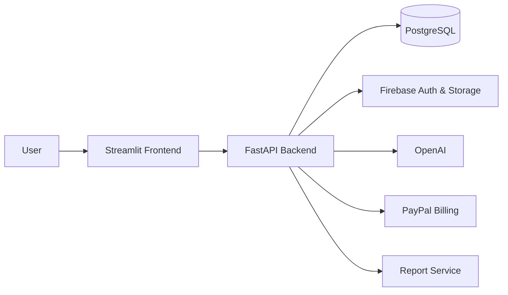
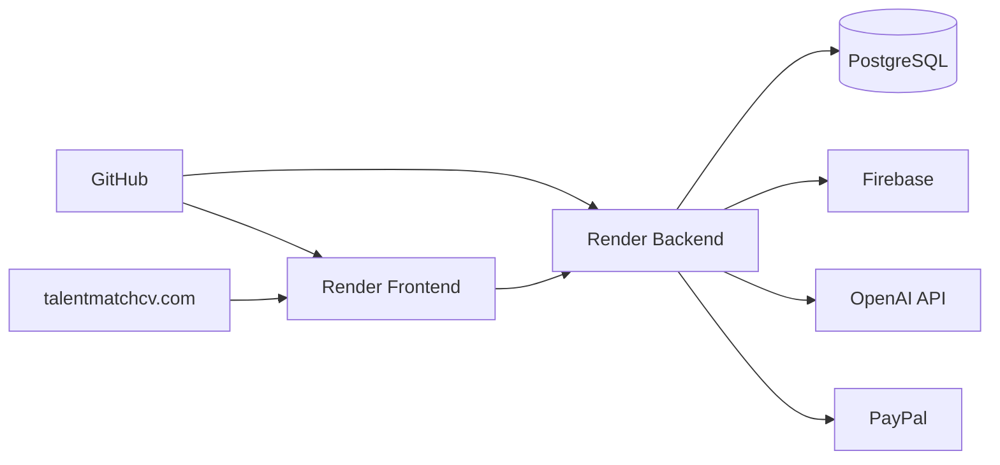
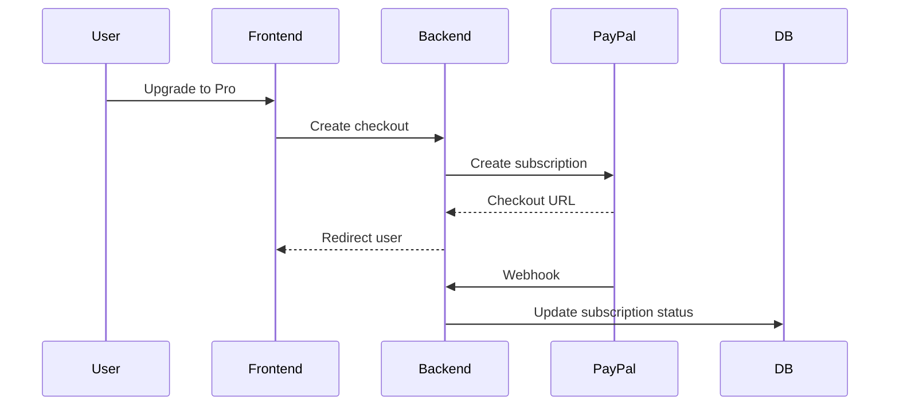

# TalentMatch Pro — Architecture Diagrams

## System Architecture

```mermaid
flowchart LR
    U[User] --> FE[Streamlit Frontend]
    FE --> BE[FastAPI Backend]
    BE --> DB[(PostgreSQL)]
    BE --> FB[Firebase Auth & Storage]
    BE --> AI[OpenAI]
    BE --> PP[PayPal Billing]
    BE --> R[Report Service]
```

## Deployment Architecture

```mermaid
flowchart LR
    GH[GitHub] --> RF[Render Frontend]
    GH --> RB[Render Backend]
    D[talentmatchcv.com] --> RF
    RF --> RB
    RB --> PG[(PostgreSQL)]
    RB --> Firebase[Firebase]
    RB --> OpenAI[OpenAI API]
    RB --> PayPal[PayPal]
```

## Billing Flow

```mermaid
sequenceDiagram
    participant User
    participant Frontend
    participant Backend
    participant PayPal
    participant DB

    User->>Frontend: Upgrade to Pro
    Frontend->>Backend: Create checkout
    Backend->>PayPal: Create subscription
    PayPal-->>Backend: Checkout URL
    Backend-->>Frontend: Redirect user
    PayPal->>Backend: Webhook
    Backend->>DB: Update subscription status
```
