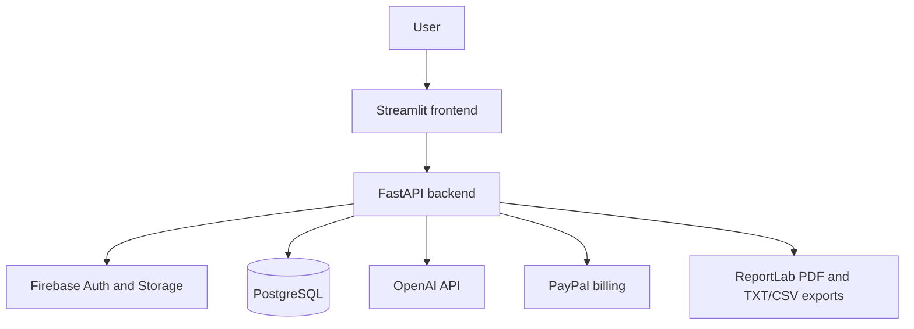
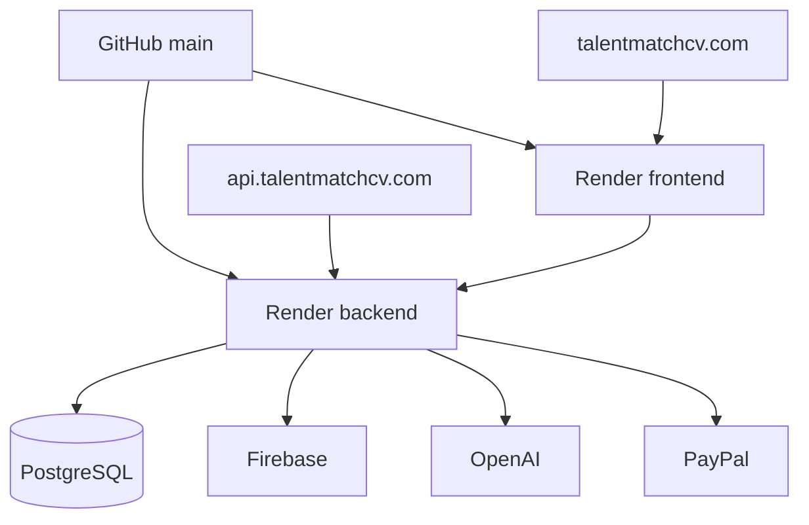
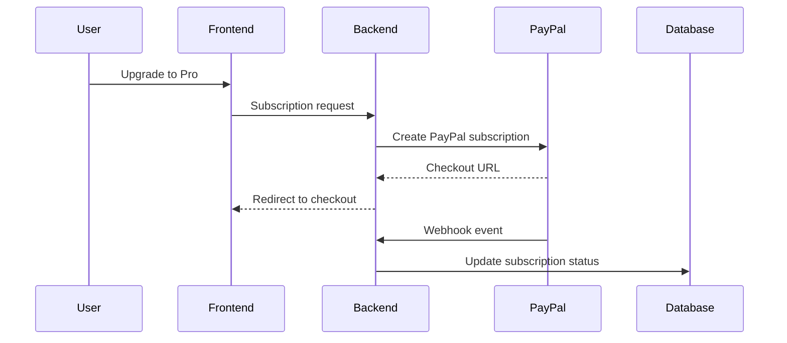

# TalentMatch Pro — Architecture Diagrams

## System Architecture

## Production Deployment

## PayPal Billing Flow

## SEO and Static Layer

| Layer | Purpose |
|---|---|
| `frontend/static/robots.txt` | Canonical robots file on the public frontend domain. |
| `frontend/static/sitemap.xml` | Canonical sitemap containing the public product routes. |
| `backend/static/` | Compatibility static files for API routes; not the primary SEO source. |

## Production Rules

- PayPal is the only active billing provider.
- Secrets are supplied through controlled configuration and never committed to Git history.
- Firebase provides authentication and storage, while PostgreSQL stores application data.
- Render hosts separate frontend and backend services.
- Changes pass local validation, Docker smoke testing, Git approval gates, and production verification.
