# TalentMatch Pro™ — GitHub Portfolio Presentation

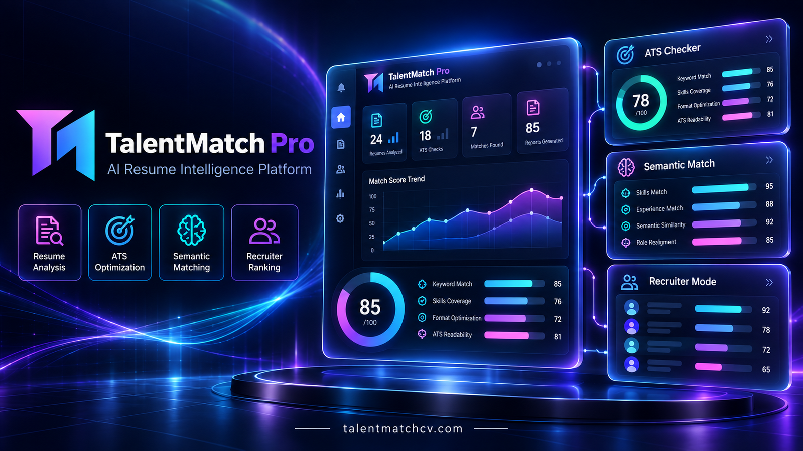

> Production AI SaaS for resume intelligence, ATS optimisation, semantic candidate matching, recruiter workflows, and professional reporting.

[Open the live application](https://talentmatchcv.com) · [Production API](https://api.talentmatchcv.com) · [API documentation](https://api.talentmatchcv.com/docs) · [Source repository](https://github.com/dejanjovic1283-ui/talentmatch-pro)

## Project snapshot

TalentMatch Pro is a production-oriented platform for job seekers, recruiters, and hiring workflows. It combines resume analysis, ATS-oriented feedback, AI-assisted rewriting, semantic matching, candidate ranking, persistent history, and exportable reports in one web workspace.

The application is designed as a real SaaS product rather than a standalone model demo. The public deployment includes authentication, persistent sessions, subscription entitlements, PayPal billing, PostgreSQL-backed data, secure API boundaries, operational health checks, and production reporting.

## Product surface

| Area | What it provides |
| --- | --- |
| CV Analysis | Structured resume intelligence, scoring, findings, and recommendations against a target role. |
| ATS Checker | ATS-oriented score, matched and missing keywords, coverage guidance, and export-ready results. |
| CV Rewrite | Role-aligned rewriting with positioning improvements, ATS context, and report output. |
| Semantic Match | Contextual similarity across skills, keywords, themes, and role relevance. |
| Recruiter Mode | Candidate review, ranking, strengths, gaps, recruiter recommendations, and exports. |
| Candidate Database | Persistent recruiter workspace for saving, reviewing, organizing, and revisiting candidates. |
| History | Saved analysis records, filters, report detail, retention controls, and PDF/TXT exports. |
| Account and Pricing | Secure account workspace, Pro entitlement visibility, usage information, and PayPal subscription controls. |

## Architecture at a glance

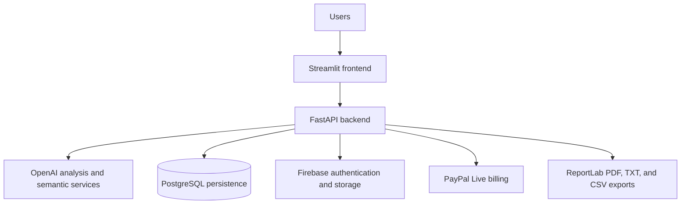

## Technology stack

| Layer | Production technology |
| --- | --- |
| Frontend | Streamlit, responsive workspace UI, 12 locales, dark/light/system themes |
| Backend | FastAPI, Python, protected API routes, structured error responses |
| AI | OpenAI-powered analysis, rewriting, scoring, and semantic matching |
| Data | PostgreSQL for persistent application state and workflow records |
| Identity and files | Firebase Authentication and Firebase Storage |
| Billing | PayPal Live subscriptions, Pro plan at `$19/month` |
| Reporting | ReportLab with Unicode and multilingual PDF support, plus TXT/CSV exports |
| Runtime and delivery | Docker, Render, Cloudflare, custom production domains |

## Engineering evidence

The project demonstrates the following production concerns in the deployed system:

- authenticated frontend-to-backend access with server-side authorization;
- PostgreSQL-backed history, candidate data, usage, and session persistence;
- durable browser sessions with explicit sign-in and sign-out behavior;
- Pro entitlement persistence and unlimited Pro CV analysis;
- PayPal-only subscription flow and subscription-settings handoff;
- request IDs, structured logs, health/readiness endpoints, and standardized JSON errors;
- rate limiting, timeout protection, retry policies, circuit breakers, and graceful degradation;
- HTTPS redirect, HSTS, trusted-host checks, security headers, CORS controls, and no secret logging;
- ETag and conditional GET support, cache-control policies, and GZip compression;
- Unicode PDF generation for English, Serbian Latin, Cyrillic, Arabic, and other supported locales;
- production SEO routes for canonical pages, `robots.txt`, and `sitemap.xml`.

## Production endpoints

| Endpoint | Purpose |
| --- | --- |
| [`talentmatchcv.com`](https://talentmatchcv.com) | Public application |
| [`api.talentmatchcv.com/healthz`](https://api.talentmatchcv.com/healthz) | Backend health check |
| [`api.talentmatchcv.com/readyz`](https://api.talentmatchcv.com/readyz) | Dependency and configuration readiness |
| [`api.talentmatchcv.com/docs`](https://api.talentmatchcv.com/docs) | API documentation |
| [`talentmatchcv.com/robots.txt`](https://talentmatchcv.com/robots.txt) | Crawler policy |
| [`talentmatchcv.com/sitemap.xml`](https://talentmatchcv.com/sitemap.xml) | Public route index |

## Selected product evidence

The public gallery focuses on the actual product surface. The full README and technical evidence remain available in the repository documentation.

### Dashboard

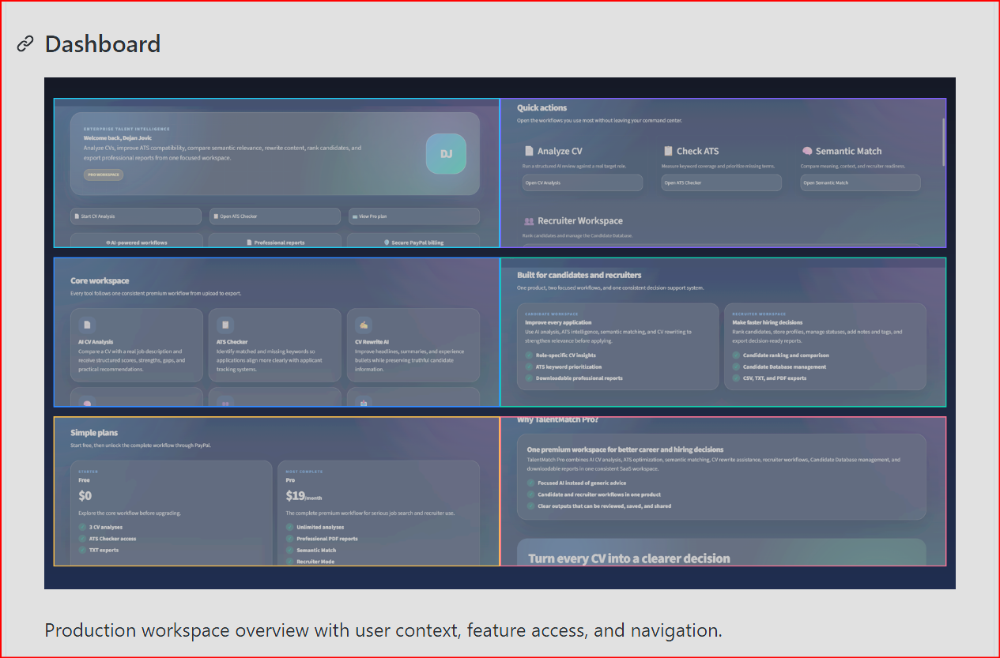

Production workspace overview with user context, feature access, and navigation.

### CV Analysis

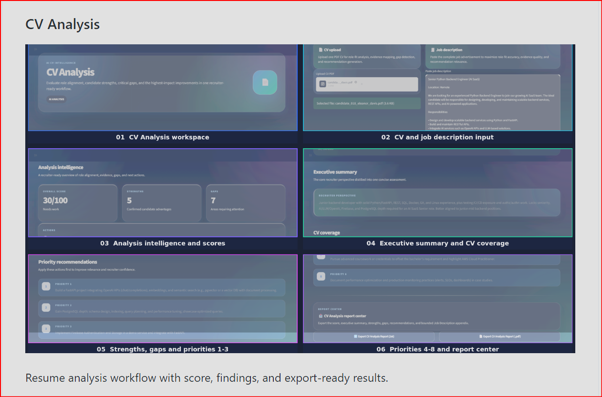

Resume analysis workflow with score, findings, and export-ready results.

### ATS Checker

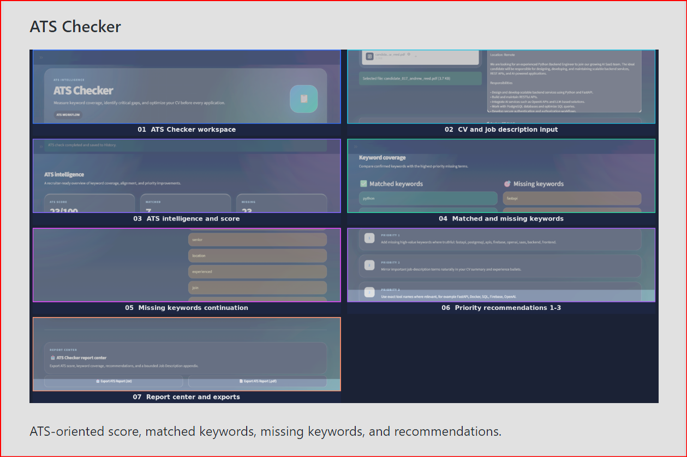

ATS-oriented score, matched keywords, missing keywords, and recommendations.

### CV Rewrite

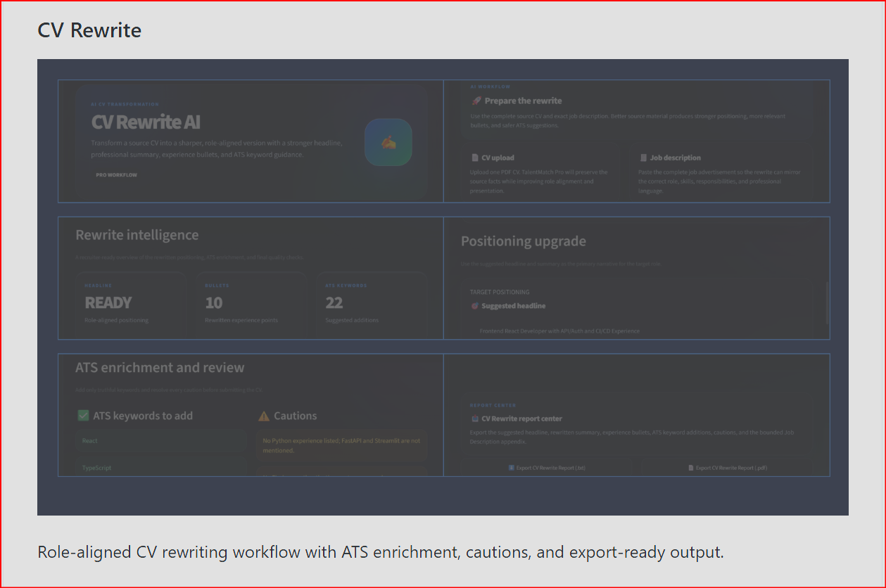

Role-aligned rewriting workflow with ATS enrichment and report output.

### Semantic Match

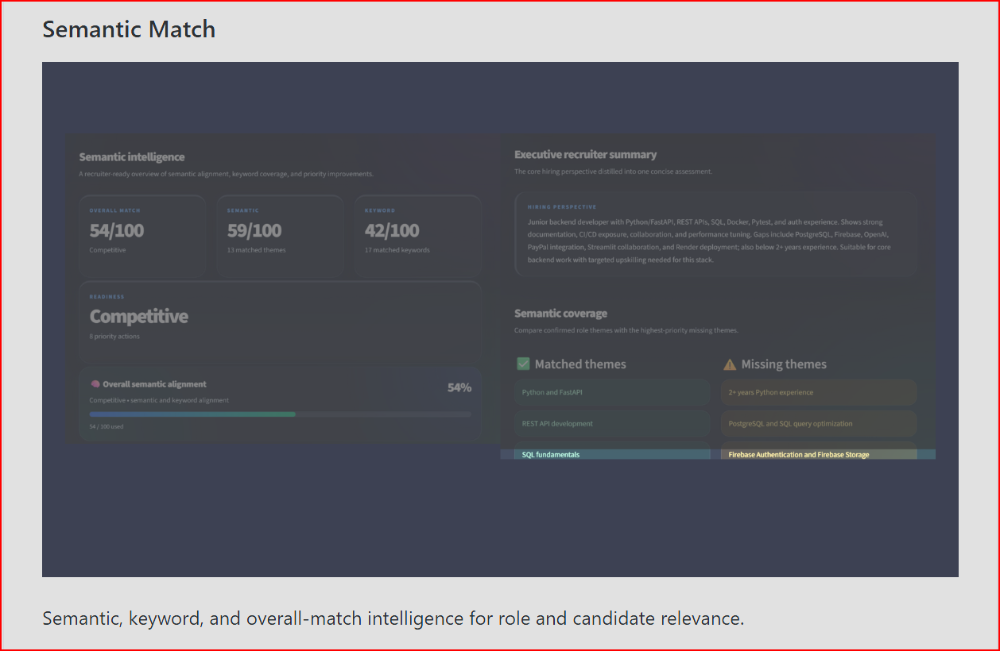

Semantic, keyword, and overall-match intelligence for role and candidate relevance.

### Recruiter Mode

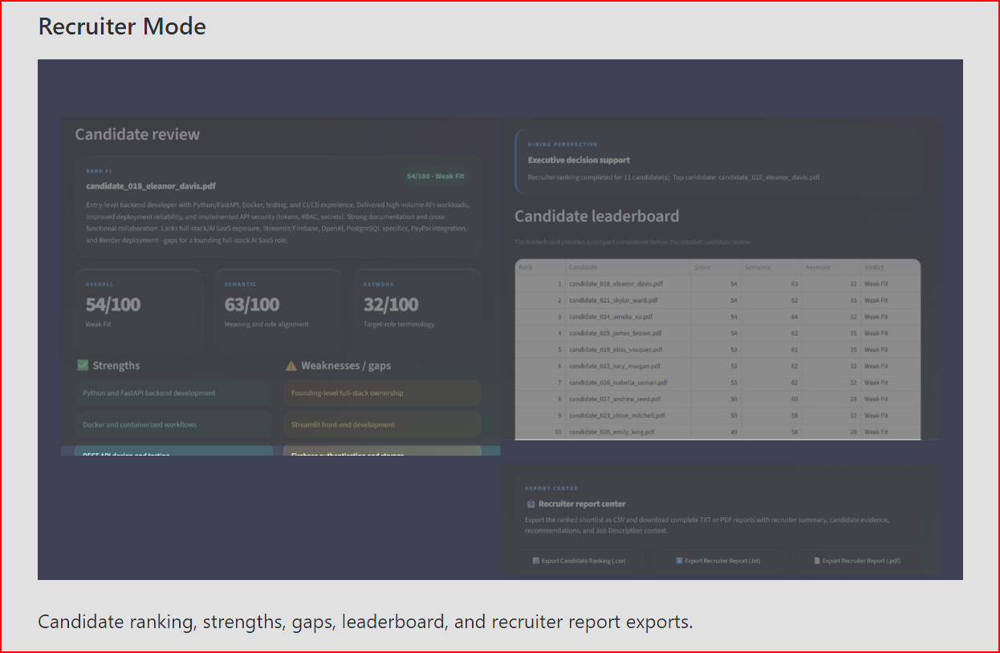

Candidate ranking, strengths, gaps, leaderboard, and recruiter report exports.

### Candidate Database

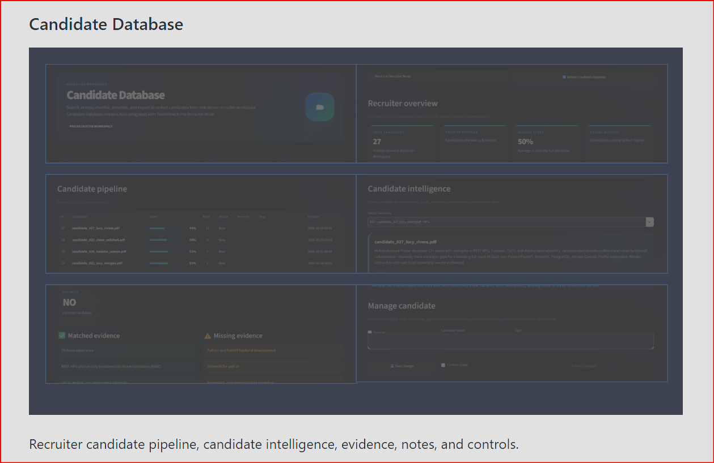

Persistent recruiter candidate pipeline, evidence, notes, and controls.

### History

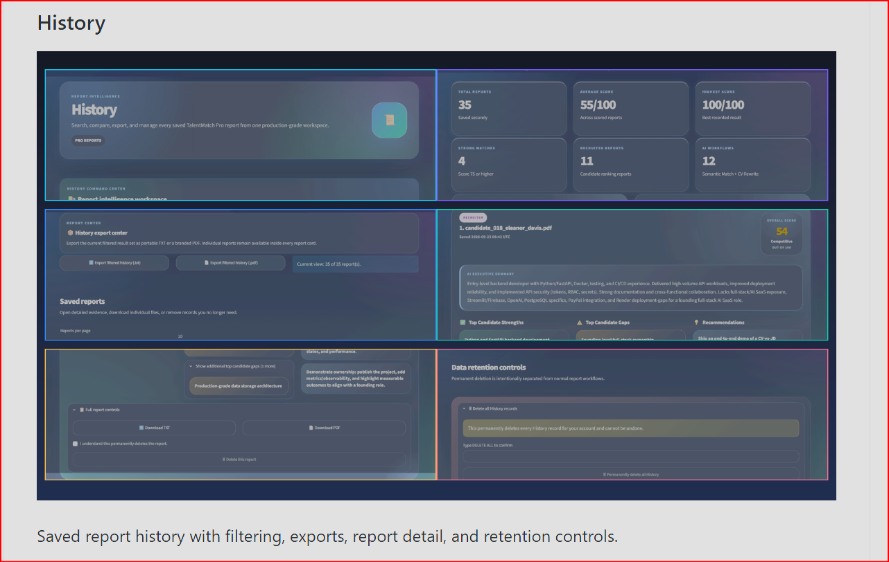

Saved report history with filtering, exports, report detail, and retention controls.

### Pricing

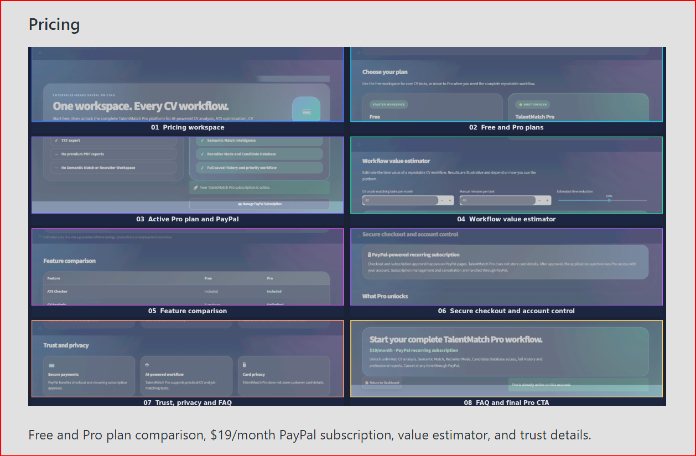

Free and Pro plan comparison, including the `$19/month` PayPal subscription.

### Account

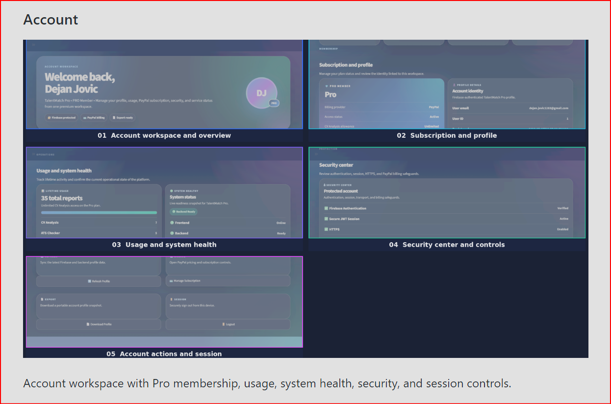

Account workspace with Pro membership, usage, system health, security, and session controls.

### Secure login session

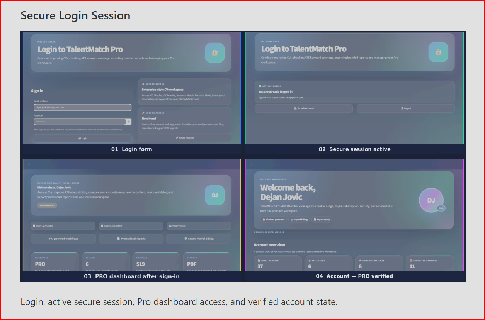

Login, active secure session, dashboard access, and verified account state.

### SEO and indexing

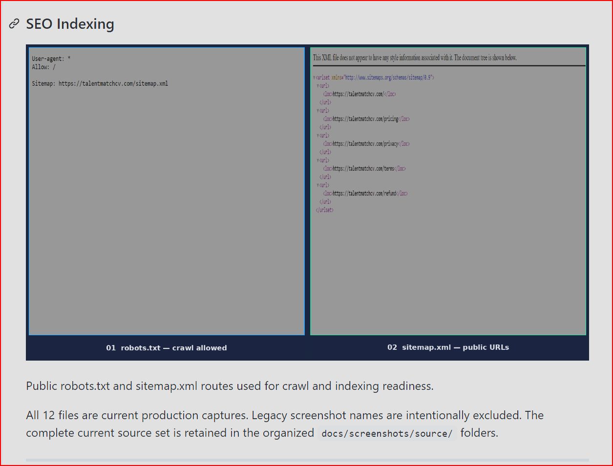

Production `robots.txt` and `sitemap.xml` routes used for crawl and indexing readiness.

## Founder

**Dejan Jović** is the founder and developer of TalentMatch Pro, responsible for the product direction, application architecture, production implementation, deployment, reporting system, and end-to-end delivery.

[Personal GitHub portfolio](https://github.com/dejanjovic1283-ui) · [LinkedIn](https://www.linkedin.com/in/dejan-jović-5babb538a)

## Education and certifications

The following qualifications support the technical focus of the product. Examination percentages and ranking positions are intentionally omitted from this public portfolio presentation.

### EITCA Artificial Intelligence

- EITCA/AI Artificial Intelligence Programme
- EITC/AI/ADL — Advanced Deep Learning
- EITC/AI/ARL — Advanced Reinforcement Learning
- EITC/AI/DLPP — Deep Learning with Python and PyTorch
- EITC/AI/DLPTFK — Deep Learning with Python, TensorFlow and Keras
- EITC/AI/DLTF — Deep Learning with TensorFlow
- EITC/AI/GCML — Google Cloud Machine Learning
- EITC/AI/GVAPI — Google Vision API
- EITC/AI/MLP — Machine Learning with Python
- EITC/AI/TFF — TensorFlow Fundamentals
- EITC/AI/TFQML — TensorFlow Quantum Machine Learning
- EITC/CL/GCP — Google Cloud Platform
- EITC/CP/PPF — Python Programming Fundamentals

### ITAcademy — AI & Python Development

- Introduction to Python Programming
- Object-Oriented Python and Core Data Structures
- Data Analysis and Processing with Python
- Interactive Data Analysis and Visualization with Python
- Databases and SQL for Data Science with Python
- Introduction to Machine Learning using Python
- R for Data Science and Data Analytics
- Cloud Data Engineering Tools
- Computer Use Basics
- Introduction to Git and GitHub
- Introduction to AI Tools — ChatGPT and Midjourney

## Release context

**TalentMatch Pro v3.0 FINAL** is the completed production baseline. The live application, API, authentication, persistence, AI workflows, billing, reporting, security controls, deployment configuration, and documentation are aligned around the production release.

## Ownership and support

Support: [support@talentmatchcv.com](mailto:support@talentmatchcv.com)

TalentMatch Pro™ © 2026 Dejan Jović. All rights reserved. This repository is public for portfolio and evaluation purposes only. No license is granted to copy, redistribute, modify, commercialise, or reuse the source, design, branding, screenshots, reports, or documentation without written permission.

See the [complete root README](../../README.md) for the full technical reference, local development instructions, repository structure, architecture notes, and production acceptance record.
