# TalentMatch Pro — Screenshot Gallery

## 01 Dashboard Overview

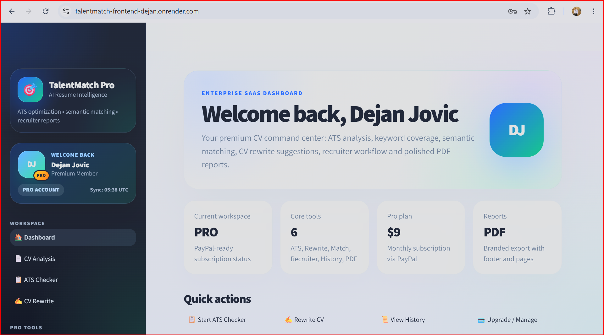

## 02 Dashboard Features

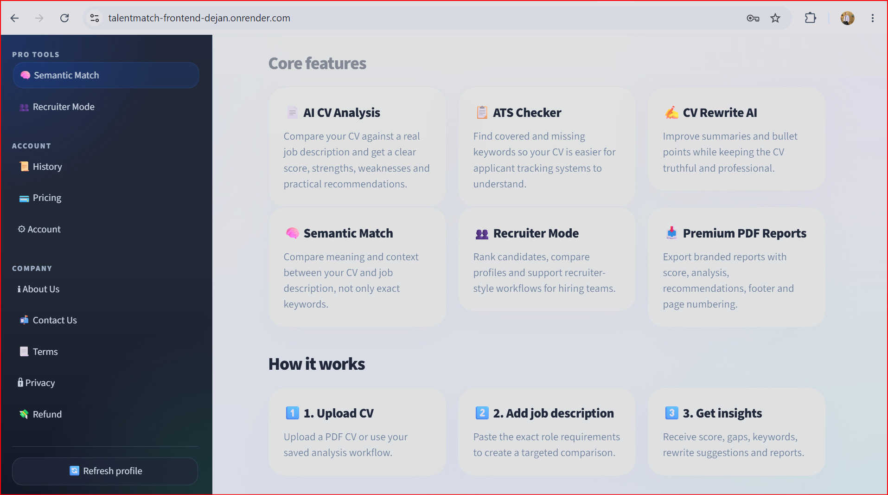

## 03 Ats Checker Input

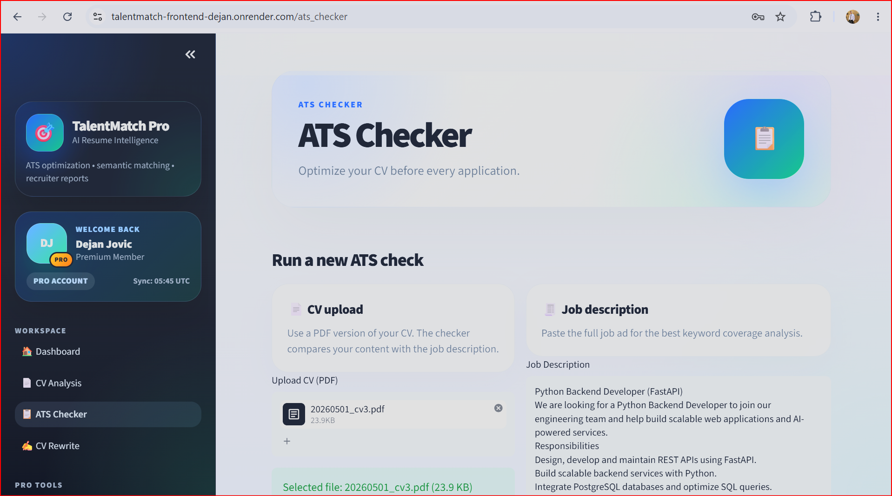

## 04 Ats Checker Results

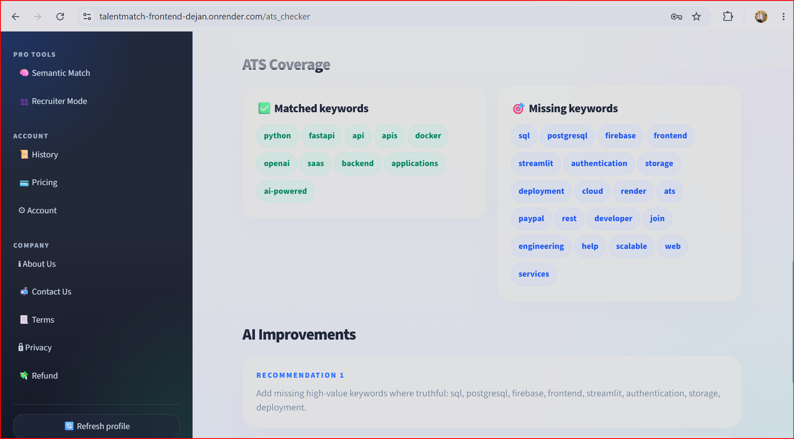

## 05 Cv Rewrite Input

## 06 Cv Rewrite Results

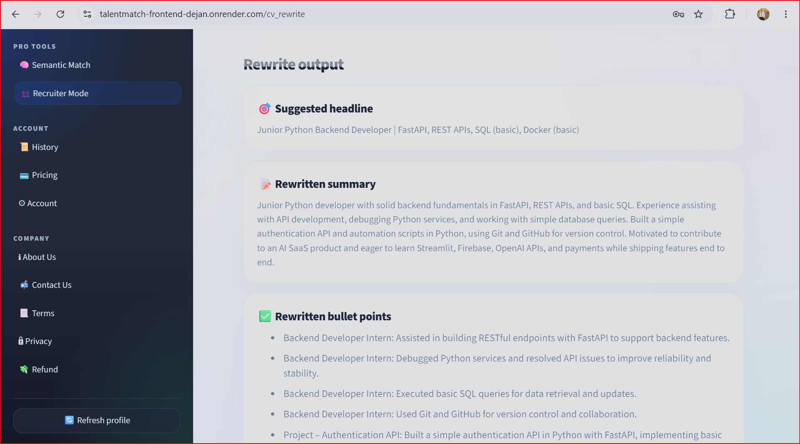

## 07 Semantic Match Input

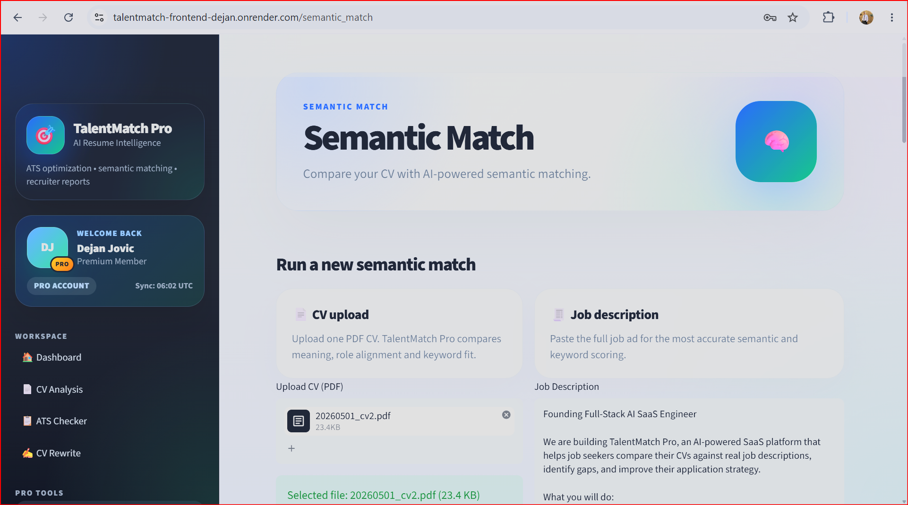

## 08 Semantic Match Results

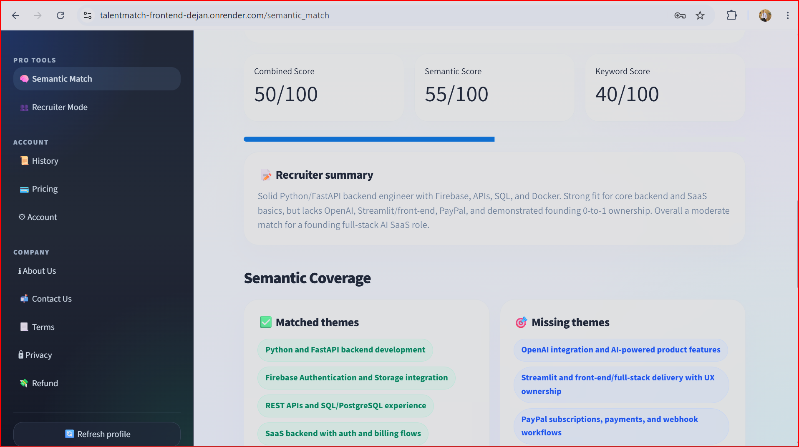

## 09 Recruiter Mode Input

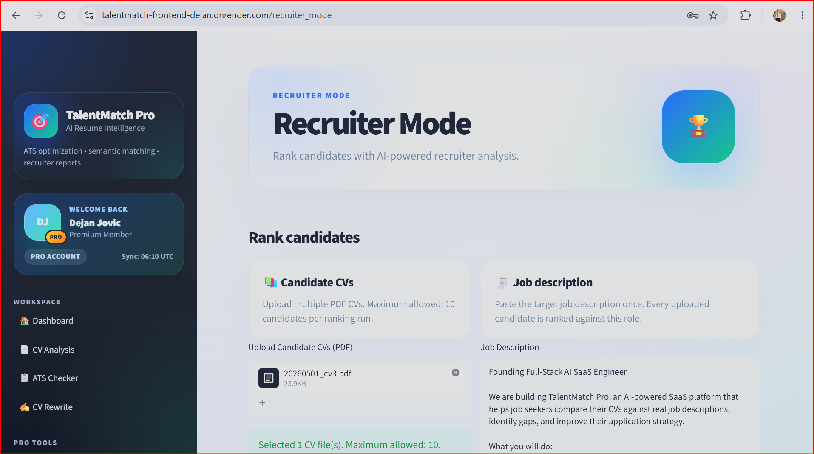

## 10 Recruiter Mode Ranking

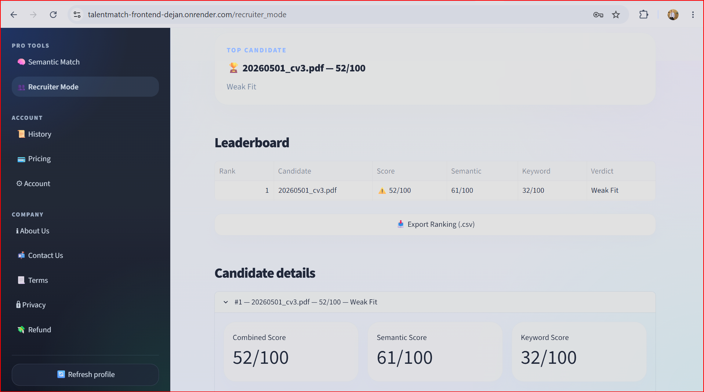

## 11 Reports History Overview

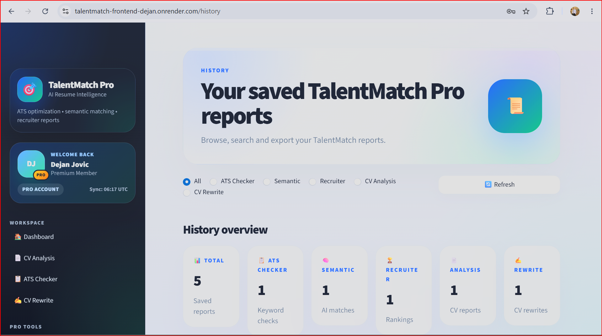

## 12 Report Detail

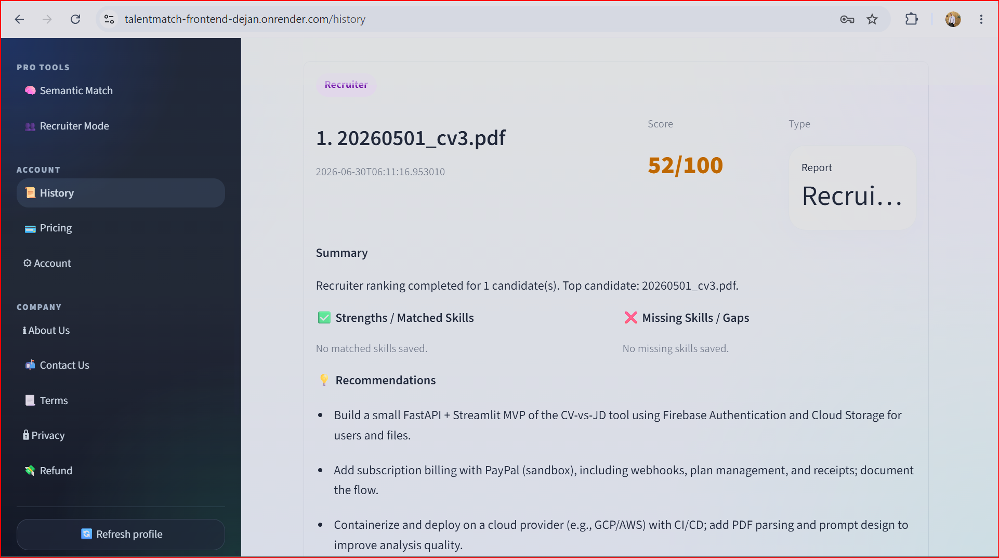

## 13 Pricing Overview

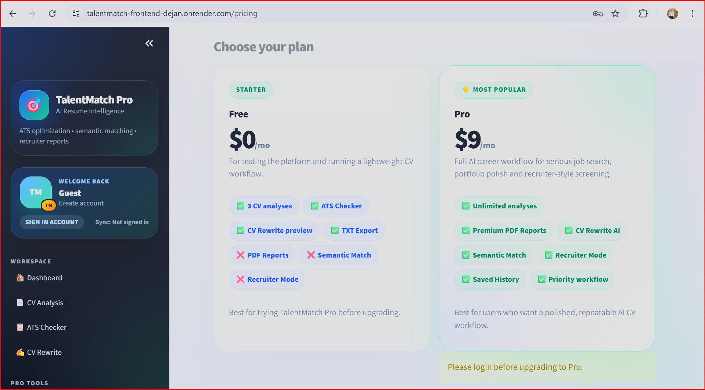

## 14 Pricing Comparison

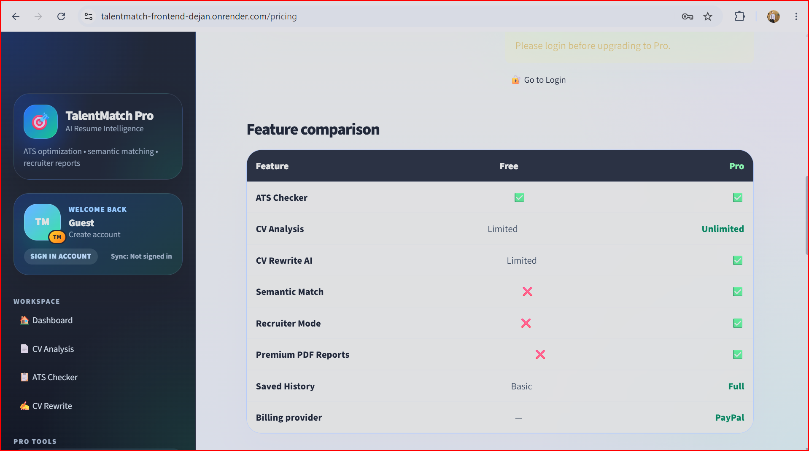

## 15 Account Overview

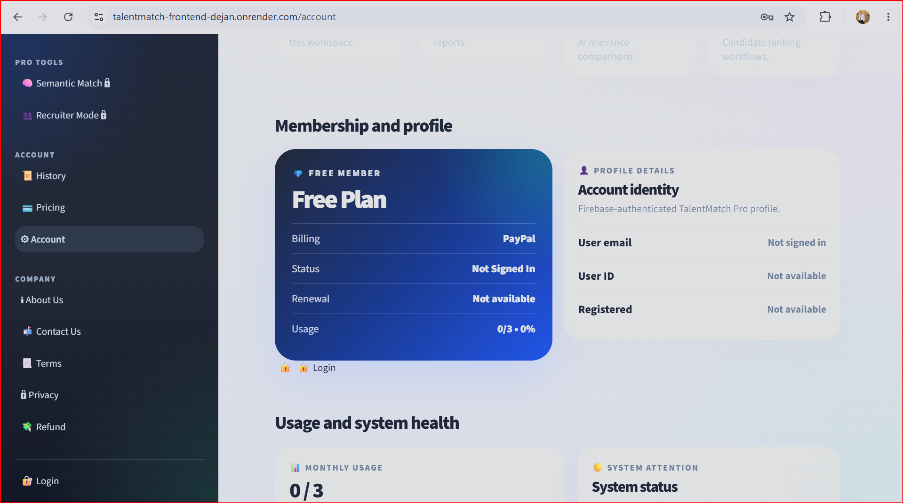

## 16 Usage And System Health

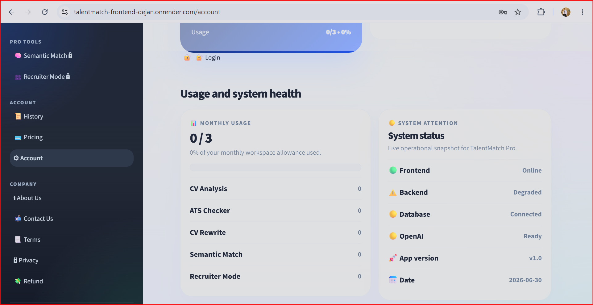

## Selected Contact Sheet

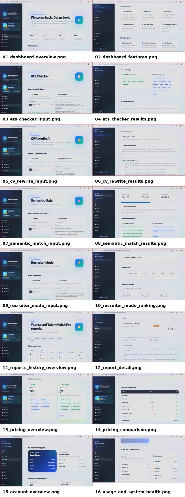
